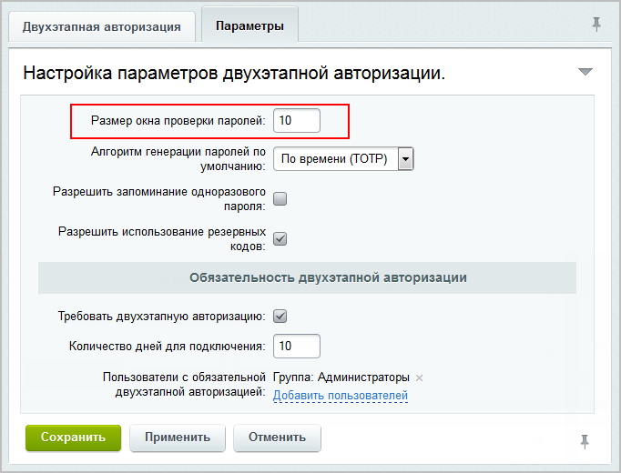

Двухэтапная авторизация и одноразовые пароли значительно усиливают систему безопасности Bitrix Framework.

## Система одноразовых паролей

Одноразовый пароль, OTP -- это пароль, который действителен только для одного сеанса аутентификации. Его действие также может быть ограничено определенным промежутком времени.

OTP обеспечивает безопасность, так как пароль невозможно использовать повторно. Даже если злоумышленник перехватит пароль, он не сможет получить доступ к системе.

### Принцип работы

При каждой авторизации пользователь получает новый секретный код, который необходимо ввести для входа.

{width=750px height=270px}

### Алгоритмы генерации OTP

1. HMAC-Based One-time Password, HOTP -- по счетчику:

   -  код действителен до тех пор, пока пользователь не запросит новый,

   -  счетчик увеличивается при каждой генерации кода,

   -  количество действующих кодов ограничено параметром *Размер окна проверки паролей*. Если число нажатий кнопки на устройстве превысит значение параметра, вход на сайт будет заблокирован. Рекомендуется указывать 5-10 кодов.

      {width=682px height=520px}

2. Time-based One-time Password, TOTP -- по времени:

   -  код действителен 30 секунд, после чего автоматически обновляется,

   -  основан на текущем времени,

   -  в смежных интервалах система может принимать два кода: текущий и следующий. Это необходимо для компенсации рассинхронизации.

### О технологии OTP

Для генерации OTP используются два параметра.

1. Секретный ключ -- начальное значение для генератора.

2. Счетчик -- текущее значение счетчика для HOTP или текущее время для TOTP.

Особенности:

-  начальное значение секретного ключа хранится как на устройстве пользователя, так и на сервере,

-  если нарушена синхронизация счетчика на устройстве и сервере, ее можно восстановить. Администратор системы должен сгенерировать два последовательных  пароля и ввести их в форму на сайте.

## Механизм двухэтапной авторизации

Чтобы использовать двухэтапную авторизацию, необходимо сначала включить механизм в модуле Проактивная защита, а затем подключить устройство для генерации одноразовых паролей.

### Как включить механизм двухэтапной авторизации

1. Перейдите на страницу *Настройки > Проактивная защита > Двухэтапная авторизация*.

2. Нажмите кнопку *Включить двухэтапную авторизацию*.

3. Настройте параметры двухэтапной авторизации.

   -  Установите размер окна для проверки паролей, если используется алгоритм HOTP. Это предотвратит рассинхронизацию при случайных нажатиях.

   -  Выберите алгоритм генерации паролей по умолчанию: HOTP (по счетчику) или TOTP (по времени).

   -  Разрешите запоминание OTP, чтобы не вводить его повторно.

   -  Разрешите генерацию резервных кодов для входа в случае утери устройства.

   -  Установите обязательное подключение двухэтапной авторизации для определенных пользователей.

   -  Укажите период, в течение которого пользователь должен подключить устройство для двухэтапной авторизации.

   -  Укажите пользователей, для которых двухэтапная авторизация будет обязательной.

   -  Включите запись всех запросов OTP в журнал событий.

   {width=592px height=625px}

Теперь пользователи должны подключить свои устройства для генерации паролей.

### Решение проблем

Если пользователь не может войти на сайт, выполните следующие действия:

-  для алгоритма TOTP -- проверьте синхронизацию времени между устройством пользователя и сервером,

-  для алгоритма HOTP -- повторно подключите устройство пользователя.

## Как подключить устройства

Для подключения доступны два типа устройств: мобильные приложения и аппаратные устройства.


 

Одновременно можно использовать только одно устройство. Если пользователь подключит новое устройство, авторизация с помощью старого станет невозможной.



### Мобильное приложение

В публичной части веб-проекта пользователи могут самостоятельно подключить мобильное приложение, например, Bitrix24 OTP.

1. Установите на смартфон приложение для генерации одноразовых паролей.

2. Отсканируйте QR-код или введите данные вручную.

3. Введите код подтверждения, который выведет приложение.


 

Перед подключением двухэтапной авторизации проверьте корректность времени и часового пояса на устройстве.



В административной части сайта подключение приложения доступно пользователям с соответствующими правами.

1. Перейдите на страницу *Настройки > Пользователи > Список пользователей*.

2. Выберите пользователя и перейдите на вкладку Двухэтапная авторизация.

3. Нажмите кнопку Подключить телефон.

4. Выберите алгоритм генерации паролей: по счетчику (HOTP) или по времени (TOTP).

5. Отсканируйте QR-код с помощью приложения.

   -  Для HOTP введите первый и второй сгенерированные коды.

   -  Для TOTP введите сгенерированный код в единственное поле.

6. Если сканирование QR-кода невозможно, введите данные вручную.

   -  Адрес сайта, например, `www.site.ru`.

   -  E-mail пользователя.

   -  Секретный ключ, который указан на картинке. Можно не обращать внимания на пробелы.

   -  Тип ключа.

### Аппаратное устройство

Для двухэтапной авторизации можно использовать аппаратные устройства. Например, USB-токен JaCarta, Рутокен и другие . Подключение устройства осуществляется через административную часть администратором или пользователем с необходимыми правами.

1. Перейдите на страницу *Настройки > Пользователи > Список пользователей*.

2. Выберите пользователя и перейдите на вкладку Двухэтапная авторизация.

3. Нажмите кнопку Подключить брелок.

4. Выберите алгоритм генерации паролей в соответствии с документацией к устройству: по счетчику (HOTP) или по времени (TOTP).

5. Для алгоритма HOTP укажите:

   -  секретный ключ,

   -  первое значение кода на устройстве,

   -  следующее значение кода на устройстве.

6. Для алгоритма TOTP укажите:

   -  секретный ключ,

   -  начальное значение счетчика времени в формате Unix Timestamp:

      -  по умолчанию `0` -- соответствует дате 01.01.1970,

      -  если устройство использует другую дату, укажите соответствующее значение, например,  `946684800` для даты 01.01.2000,

   -  первое значение кода на устройстве.

### Действия после подключения

После подключения устройства можно выполнить следующие действия:

-  отключить  двухэтапную авторизацию навсегда или на определенный срок,

-  получить резервные коды для входа,

-  синхронизировать устройство с сервером,

-  подключить новый брелок/телефон.

{width=750px height=295px}

## Резервные коды

Резервные коды позволяют пользователям войти на сайт или портал, когда устройство двухэтапной авторизации недоступно.


 

Функционал резервных кодов доступен, если в настройках двухэтапной авторизации отмечена опция *Разрешить использование резервных кодов*.



### Как сгенерировать резервные коды

Резервные коды может получить администратор или самостоятельно пользователь при наличии прав доступа.

1. Перейдите на страницу *Настройки > Пользователи > Список пользователей*.

2. Выберите пользователя и перейдите на вкладку Двухэтапная авторизация.

3. Нажмите ссылку Резервные коды.

4. Скопируйте коды из формы. Каждый код можно использовать только один раз, поэтому генерируйте новые коды по необходимости.

{width=726px height=623px}

Рекомендуется генерировать 10–20 кодов и хранить их в защищенном месте, например, в менеджере паролей.

Текущие резервные коды можно отозвать в любой момент и сгенерировать новые.

Если пользователь не может воспользоваться устройством и резервными кодами, администратор вправе временно отключить для него двухэтапную авторизацию.

## Синхронизация устройства для двухэтапной авторизации

Повторная синхронизация необходима при рассинхронизация устройства и сервера. Это может случиться, если на устройстве было случайно сгенерировано несколько паролей без успешной аутентификации.

### Как выполнить синхронизацию

Синхронизацию может выполнить администратор или самостоятельно пользователь при наличии прав доступа.

1. Перейдите на страницу *Настройки > Пользователи > Список пользователей*.

2. Выберите пользователя и перейдите на вкладку Двухэтапная авторизация.

3. Нажмите ссылку Синхронизировать.

4. Сгенерируйте два последовательных OTP на устройстве и введите их в форму.

{width=750px height=361px}

Счетчик на сервере будет приведен в соответствие с устройством.

## Компоненты

В модуле Проактивная защита доступны компоненты Подключение устройства OTP `bitrix:security.user.otp.init` и Резервные коды OTP `bitrix:security.user.recovery.codes`. С их помощью администратор может создать страницы, где пользователи будут самостоятельно подключать устройства и получать резервные коды.


 

Страницы доступны только для авторизованных пользователей.



### Подключение устройства OTP

Компонент Подключение устройства OTP `bitrix:security.user.otp.init` предназначен для вывода формы подключения нового устройства.

1. Создайте новую страницу. Например, Двухэтапная авторизация.

2. Разместите на странице компонент Подключение устройства OTP.

3. Создайте удобную ссылку на эту страницу. Например, в меню личного кабинета пользователя.

### Резервные коды OTP

Компонент Резервные коды OTP `bitrix:security.user.recovery.codes` предназначен для вывода формы с резервными кодами.

1. Создайте новую страницу. Например, Резервные коды.

2. Разместите на странице компонент Резервные коды OTP.

3. Создайте удобную ссылку на эту страницу. Например, в меню личного кабинета пользователя.