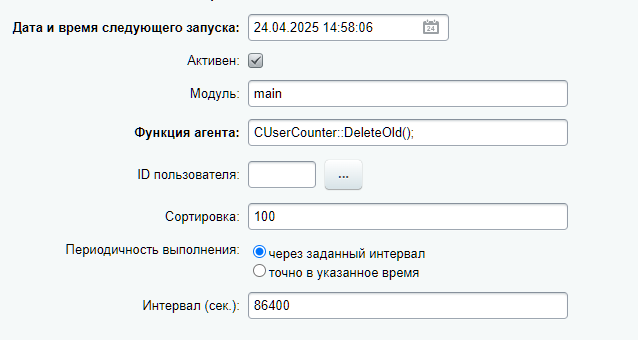

---
title: Агенты и фоновые задачи
---|
| Запуск             | При посещении сайта посетителями (на хитах) и по расписанию через cron | Сразу после ответа пользователю |
| Время выполнения   | Могут задерживаться                                                    | Почти мгновенное                |
| Приоритеты         | Нет                                                                    | Есть                            |
| Подходит для       | Регулярных задач                                                       | Разовых тяжелых операций        |

Для сложных сценариев можно комбинировать оба подхода.

```php
// Фоновая задача запускает агента для поэтапной обработки
$app->addBackgroundJob(function() {
    CAgent::AddAgent(
        "MyLongProcess::start();",
        "mymodule",
        "N",
        0
    );
});
```

## Агенты

Агент -- это запись в базе данных, которая содержит:

-  код для выполнения,

-  время следующего запуска,

-  интервал выполнения,

-  тип агента: периодический или непериодический.

Агенты выполняются в однопоточном режиме. Если агент работает дольше 10 минут, система блокирует его повторный запуск -- это защита от дублирования. На другие агенты и процессы блокировка не влияет.

### Типы агентов

-  **Периодические.** Запускаются в указанное время.

   `Время следующего запуска = время предыдущего запуска + интервал`.

-  **Непериодические.** Запускаются через заданный интервал и только после успешного завершения предыдущего выполнения, что исключает накладки.

   `Время следующего запуска = время окончания работы + интервал`.

### Зарегистрировать агента

Для работы с агентами используйте методы класса [CAgent](https://dev.1c-bitrix.ru/api_help/main/reference/cagent/index.php).

-  Метод `addAgent` добавляет агент.

   ```php
   CAgent::AddAgent(
       "MyFunction();",      // Имя функции для вызова
       "mymodule",           // Модуль. Передавайте пустое значение для функций в init.php
       "N",                  // Периодичность: "N" — непериодический, "Y" — периодический
       3600,                 // Интервал в секундах. Например, 3600 сек, то есть 1 час
       "",                   // Дата проверки в формате YYYY-MM-DD HH:MI:SS
       "Y",                  // Активность: "Y" — активен, "N" — неактивен
       "",                   // Дата следующего выполнения в формате YYYY-MM-DD HH:MI:SS
       100,                  // Сортировка. Чем меньше значение, тем выше приоритет
       false,                // ID пользователя. По умолчанию false, то есть для системных агентов
       true                  // Выдавать ошибку при дублировании агента
   );
   ```

-  Метод `RemoveAgent` удаляет агент.

   ```php
   CAgent::RemoveAgent(
       "MyFunction();",      // Имя функции агента
       "mymodule",           // Модуль. Передавайте пустое значение для функций в init.php
       false                 // ID пользователя. По умолчанию false, то есть для системных агентов
   );
   ```

### Создать агента через интерфейс

Агента можно добавить через административный раздел на странице *Настройки > Настройки продукта > Агенты*. Нажмите *Добавить агента* и заполните параметры, аналогичные регистрации через функцию `addAgent`.

{width=638px height=340px}

### Запустить агента

-  **На хитах.** Агент срабатывает, когда посетитель заходит на страницу. Точность запуска зависит от посещаемости сайта. Система обрабатывает агентов по одному и при большом трафике агенты на хитах создают нагрузку на сайт.

-  **Через cron**. Агент запускается точно по расписанию и не зависит от посещаемости. Это снижает нагрузку на сайт.

#### Частично перевести запуск на cron

Агенты можно перевести на cron частично. Система продолжит запускать агенты при посещениях, а cron будет запускать только часть агентов.

1. Откройте страницу *Настройки > Инструменты > Командная PHP-строка.* Выполните код:

   ```php
   // Включить частичный перевод агентов на cron
   COption::SetOptionString(
       "main",                 // Модуль main
       "agents_use_crontab",   // Настройка использования cron
       "Y"                     // Y — разрешить, N — запретить
   );
   
   // Проверить текущее значение настройки
   echo COption::GetOptionString("main", "agents_use_crontab", "N"); // вернет значение Y
   ```

   После выполнения кода система будет запускать на хитах только периодические агенты.

2. Добавьте задание cron на сервере:

   ```bash
   # Выполнять каждые 10 минут от имени пользователя
   */10 * * * * bitrix /usr/bin/php -f /home/bitrix/www/bitrix/modules/main/tools/cron_events.php
   ```

   Часть пути `/home/bitrix/www/`  замените на путь к вашему сайту.

#### Полностью перевести запуск на cron

Агенты не будут зависеть от посещаемости сайта и сработают точно по расписанию.

1. Откройте страницу *Настройки > Инструменты > Командная PHP-строка*. Выполните код, который полностью отключит запуск агентов.

   ```php
   COption::SetOptionString(
       "main",                 // Модуль main
       "agents_use_crontab",   // Настройка использования cron
   	"N"                     // Y — разрешить, N — запретить
   ); 
   echo COption::GetOptionString("main", "agents_use_crontab", "N"); // Выведет значение N — cron отключен для агентов
   
   COption::SetOptionString(
       "main",                 // Модуль main
       "check_agents",         // Настройка проверки агентов
   	"N"                     // Y — разрешить, N — запретить
   );
   echo COption::GetOptionString("main", "check_agents", "Y"); // Выведет значение N — значит автоматическая проверка агентов отключена
   ```

2. Удалите в файле `/bitrix/php_interface/dbconn.php` константы `BX_CRONTAB_SUPPORT` и `BX_CRONTAB`.

   ```php
   define("BX_CRONTAB_SUPPORT", true);
   define("BX_CRONTAB", true);
   ```

3. Добавьте в файл строчку:

   ```php
   if (!(defined("CHK_EVENT") && CHK_EVENT===true)) {
       define("BX_CRONTAB_SUPPORT", true); // Разрешаем работу через cron
       // При этом обычные хиты не будут запускать агентов
   }
   ```

4. Создайте файл `/bitrix/php_interface/cron_events.php`, который будет проверять агенты и рассылки системных сообщений. Разместите в нем код:

   ```php
   <?php
   // Устанавливаем корневую директорию
   $_SERVER["DOCUMENT_ROOT"] = realpath(dirname(__FILE__)."/../..");
   
   // Отключаем проверки для ускорения работы
   define("NO_KEEP_STATISTIC", true);       // Не вести статистику
   define("NOT_CHECK_PERMISSIONS", true);   // Не проверять права
   define('BX_NO_ACCELERATOR_RESET', true); // Не сбрасывать акселератор
   
   // Указываем, что это вызов через cron
   define('CHK_EVENT', true);
   
   // Разрешаем обработку после эпилога, для некоторых модулей
   define('BX_WITH_ON_AFTER_EPILOG', true);
   
   // Подключаем ядро Bitrix
   require($_SERVER["DOCUMENT_ROOT"]."/bitrix/modules/main/include/prolog_before.php");
   
   // Увеличиваем время выполнения
   @set_time_limit(0);                     // Без ограничения времени
   @ignore_user_abort(true);               // Продолжать при обрыве связи
   
   // 1. Проверяем и запускаем агентов
   CAgent::CheckAgents();
   
   // Константы, которые обычно определяются в dbconn.php
   define("BX_CRONTAB_SUPPORT", true);      // Поддержка cron
   define("BX_CRONTAB", true);              // Пометка текущего выполнения как cron
   
   // 2. Обрабатываем почтовые события (если модуль установлен)
   if(CModule::IncludeModule('sender')) {
       \Bitrix\Sender\MailingManager::checkPeriod(false);
       \Bitrix\Sender\MailingManager::checkSend();
   }
   
   // Завершаем работу
   require($_SERVER['DOCUMENT_ROOT']."/bitrix/modules/main/tools/backup.php");
   CMain::FinalActions();
   ```

   -  Скрипт устанавливает `CHK_EVENT=true` перед подключением ядра.

   -  Система определяет, что это cron, и разрешает работу агентов.

   -  Функция `CheckAgents()` запускает всех агентов, которые должны выполниться.

5. Добавьте задание cron на сервере:

   ```bash
   # Выполнять каждые 10 минут от имени пользователя
   */10 * * * * bitrix /usr/bin/php -f /home/bitrix/www/bitrix/modules/main/tools/cron_events.php
   ```

   Часть пути `/home/bitrix/www/`  замените на путь к вашему сайту.

#### Вернуть запуск агентов на хитах

1. В таблице `b_option` удалите записи `NAME = agents_use_crontab` и `NAME = check_agents`.

2. Очистите управляемый кеш в административном разделе.

3. Удалите изменения из `/bitrix/php_interface/dbconn.php`.

### Функции агентов

Функция агента -- это PHP-код, который выполняется при запуске агента. Функция должна вернуть строку с кодом для следующего запуска. Чтобы остановить агента -- пустую строку.

```php
function TestAgent() {
    mail('mail@gmail.com', 'Тест агента', 'Агент работает'); // код функции
    return "TestAgent();"; // Для повторного запуска
	// Для остановки агента передайте пустой return "";
}
```

#### Где размещать функции

-  **В модуле.** Укажите модуль при регистрации агента. Функция становится доступной после подключения модуля, то есть файла `/bitrix/modules/[MODULE_ID]/include.php`.

   ```php
   CAgent::AddAgent("Function();", "module_id");
   ```

-  **Без модуля.** Разместите функцию в файле `/bitrix/php_interface/init.php`. Модуль в параметрах регистрации указывать не нужно.

   ```php
   CAgent::AddAgent("Function();");
   ```

### Примеры агентов

1. Очистить статистику.

   ```php
   CAgent::AddAgent(
   	"CStatistic::CleanUpStatistics_2();", // имя функции
   	"statistic",                          // идентификатор модуля
   	"N",                                  // агент не критичен к кол-ву запусков
   	86400,                                // интервал запуска — 1 сутки
   	"07.04.2025 20:03:26",                // дата первой проверки на запуск
   	"Y",                                  // агент активен
   	"07.04.2025 20:03:26",                // дата первого запуска
   	30
   );
   ```

2. Ограничить число запусков агента.

   ```php
   // Агент завершится после 5 запусков
   class CMyModule {
       public static function AgentLimited($count = 1) {
           if ($count >= 5) return ""; // Остановка агента
           return "CMyModule::AgentLimited(".($count+1).");"; // Следующий запуск
       }
   }
   
   // Регистрируем агент
   CAgent::AddAgent(
       "CMyModule::AgentLimited();",
       "my_module",
       "Y",
       86400
   );
   ```

3. Обновить курс валют. Курс валюты не должен зависеть от хитов, поэтому агента нужно запускать через cron.

   ```php
   function AgentCurrencyUpdate() {
       // Проверка подключения модуля валют
       if (!CModule::IncludeModule('currency')) {
           return "AgentCurrencyUpdate();"; // Повторить попытку
       }
   
       // Запрос к API ЦБ (возвращает курс рубля к валютам)
       $json = file_get_contents('https://api.exchangerate.host/latest?base=RUB');
       if (!$json) {
           return "AgentCurrencyUpdate();"; // Ошибка запроса — повторить
       }
   
       // Декодирование JSON и проверка данных
       $data = json_decode($json, true);
       $rates = $data['rates'] ?? [];
       if (empty($rates)) {
           return "AgentCurrencyUpdate();"; // Нет данных — повторить
       }
   
       // Обновление курсов в базе
       foreach (['USD', 'EUR'] as $currency) {
           // Конвертируем курс (1 USD = X RUB, 1 RUB = 1/X USD)
           $convertedRate = 1 / ($rates[$currency] ?? 1);
           
           CCurrencyRates::Add([
               'CURRENCY' => $currency,    // Код валюты
               'DATE_RATE' => date('Y-m-d'), // Текущая дата
               'RATE' => $convertedRate,   // Рассчитанный курс
               'RATE_CNT' => 1             // Номинал, 1 единица валюты
           ]);
       }
   
       // Запланировать следующий запуск
       return "AgentCurrencyUpdate();";
   }
   ```

### Ограничения агентов

1. Нет доступа к переменной `$USER`.

2. Нельзя использовать авторизацию методом `Authorize`.

3. Нет константы `SITE_ID`.

4. Нельзя определить заранее язык на многоязычных сайтах.

## Фоновые задачи

Фоновые задачи выполняются сразу после отправки ответа пользователю в рамках одного HTTP-запроса. Они не замедляют работу сайта, но не гарантируют выполнение. Фоновая задача может не выполниться при аварийном завершении скрипта.

1. Задача ставится в очередь.

2. После отправки контента пользователю система выполняет задачу.

3. Во время выполнения задачи ответ сервера не блокируется.

Фоновые задачи можно использовать:

-  чтобы отправить почту после регистрации,

-  сгенерировать документ в формате PDF,

-  выполнить синхронизацию с внешними API,

-  обработать загруженный файл,

-  массово обновить данные.

### Добавить фоновую задачу

Метод `addBackgroundJob` добавляет фоновую задачу.

```php
\Bitrix\Main\Application::addBackgroundJob(
    $job,
    $args,
    $priority
)
```

-  `$job` -- вызываемая функция или метод. В качестве значения можно передать вызываемую функцию (callable)  `"myFunction"` или массив для методов `["MyClass", "method"]`.

-  `$args` -- массив аргументов для вызова функции или метода.

-  `$priority` -- приоритет выполнения. Возможные значения:

   ```php
   \Bitrix\Main\Application::JOB_PRIORITY_NORMAL // 100, используется по умолчанию
   \Bitrix\Main\Application::JOB_PRIORITY_LOW    // 50
   ```

### Примеры фоновых задач

1. Базовый пример с функцией отправки письма.

   ```php
   $app = \Bitrix\Main\Application::getInstance();
   $app->addBackgroundJob(
       [EmailService::class, 'sendWelcome'],
       ['user@example.com', 'Добро пожаловать!'],
   );
   
   function sendWelcomeEmail($email, $message) {
       mail($email, 'Уведомление', $message);
   }
   ```

2. Пример фоновой задачи с низким приоритетом. Функция обрабатывает загруженный файл.

   ```php
   // Подготовка файла перед фоновой задачей
   $tmpFilePath = \Bitrix\Main\Application::getDocumentRoot().'/upload/tmp/'.uniqid('file_');
   
   // Перемещаем загруженный файл в постоянное хранилище
   if (!move_uploaded_file($_FILES['big_file']['tmp_name'], $tmpFilePath)) {
       throw new \Exception('File upload failed');
   }
   
   // Регистрируем фоновую задачу
   $app = \Bitrix\Main\Application::getInstance();
   $app->addBackgroundJob(
       // Используем callable-синтаксис для вызова функции, которая обработает файл
       [FileProcessor::class, 'processLargeFile'],
       // Передаем файл
       [
           'path' => $tmpFilePath,
           'original_name' => $_FILES['big_file']['name']
       ],
       // Устанавливаем низкий приоритет
       \Bitrix\Main\Application::JOB_PRIORITY_LOW
   );
   ```