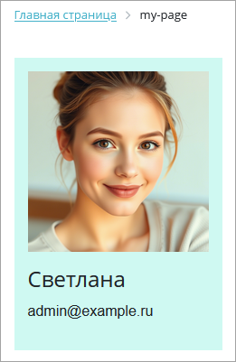

С помощью Bitrix Framework можно создавать свои компоненты, чтобы расширить возможности проекта. В статье описан процесс создания на примере компонента *Карточка пользователя*.

1. Компонент будет отображать имя, аватар и, при необходимости, email пользователя.

2. При клике на аватар фотография откроется в новом окне.

## Размещение и именование компонента

Пользовательские компоненты размещают в папке `/local/components/`. Это отделяет их от системных и упрощает обновление системы.

Имена компонентов строят иерархически в формате `идентификатор1.идентификатор2...`. Начинают с общего понятия и заканчивают конкретным назначением компонента. Полное имя  включает пространство имен: `пространство_имен:имя_компонента`.

Компонент Карточка пользователя можно назвать `my:user.card`. Для этого создайте папки:

-  `my` в `/local/components/`,

-  `user.card` в `/local/components/my/`.

## Структура компонента

Создайте следующие папки и файлы для компонента:

```
/local/components/my/user.card/
├── .description.php        // Описание компонента
├── .parameters.php         // Параметры компонента
├── class.php               // Логика компонента
├── templates/
│ ├── .default/
│ │ ├── template.php        // Шаблон вывода
│ │ ├── script.js           // Логика для карточки
│ │ └── style.css           // Стили карточки
└── lang/
    └── ru/
        └── messages.php    // Локализация
```



Каждый файл `*.php` содержит строку `if (!defined('B_PROLOG_INCLUDED') || B_PROLOG_INCLUDED !== true) die();`. Это предотвращает прямой вызов файла из браузера.



### Файл .description.php

Файл `.description.php` содержит массив `$arComponentDescription` с основными характеристиками компонента. В массив передайте название компонента, описание и расположение в дереве компонентов.

```php
<?php

if (!defined('B_PROLOG_INCLUDED') || B_PROLOG_INCLUDED !== true) die();

$arComponentDescription = [
    'NAME' => 'Карточка пользователя',
    'DESCRIPTION' => 'Выводит небольшую карточку с информацией об указанном пользователе',
    'PATH' => [
        'ID' => 'my',
        'NAME' => 'Мои компоненты',
    ],
];
```

### Файл .parameters.php

Файл `.parameters.php` содержит массив `$arComponentParameters`, который описывает входные параметры компонента. Добавьте в массив группу `USER_CARD` и два параметра:

-  `USER_ID` -- числовой параметр с идентификатором пользователя,

-  `SHOW_EMAIL` -- чекбокс, который определяет, показывать ли email.

```php
<?php

if (!defined('B_PROLOG_INCLUDED') || B_PROLOG_INCLUDED !== true) die();

$arComponentParameters = [
    'GROUPS' => [
        'USER_CARD' => [
            'NAME' => 'Параметры карточки пользователя',
        ],
    ],
    'PARAMETERS' => [
        'USER_ID' => [
            'NAME' => 'Идентификатор пользователя',
            'TYPE' => 'NUMBER',
            'PARENT' => 'USER_CARD',
        ],
        'SHOW_EMAIL' => [
            'NAME' => 'Показывать email',
            'TYPE' => 'CHECKBOX',
            'DEFAULT' => 'Y',
            'PARENT' => 'USER_CARD',
        ],
    ],
];
```

### Файл class.php

Файл `class.php` -- основной файл логики компонента. Чтобы получить данные пользователя и передать их в шаблон, используйте методы:

-  `initResult()` -- получает данные из базы,

-  `executeComponent()` -- выполняет компонент и кеширует результаты.

```php
<?php
if (!defined('B_PROLOG_INCLUDED') || B_PROLOG_INCLUDED !== true) die();

class UserCardComponent extends CBitrixComponent
{
	/**
	 * Подготавливаем входные параметры
	 *
	 * @param  array $arParams
	 *
	 * @return array
	 */
	public function onPrepareComponentParams($arParams)
	{
		$arParams['USER_ID'] ??= 0;
		$arParams['SHOW_EMAIL'] ??= 'Y';
		
		return $arParams;
	}
	/**
	 * Основной метод выполнения компонента
	 *
	 * @return void
	 */

	public function executeComponent()
	{
		// Кешируем результат, чтобы не делать постоянные запросы к базе
		if ($this->startResultCache())
		{
			$this->initResult();
			
			// Если ничего не найдено, отменяем кеширование
			if (empty($this->arResult))
			{
				$this->abortResultCache();
				ShowError('Пользователь не найден');
				
				return;
			}
			
			$this->includeComponentTemplate();
		}
	}

	/**
	 * Инициализируем результат
	 *
	 * @return void
	 */
	private function initResult(): void
	{
		$userId = (int)$this->arParams['USER_ID'];
		if ($userId < 1)
		{
			return;
		}
		
		$user = \Bitrix\Main\UserTable::query()
			->setSelect([
				'NAME',
				'EMAIL',
				'PERSONAL_PHOTO',
			])
			->where('ID', $userId)
			->fetch()
		;
		if (empty($user))
		{
			return;
		}

		$this->arResult = [
			'NAME' => $user['NAME'],
			'EMAIL' => $user['EMAIL'],
		];
		
		// Получаем путь до аватара, если он указан
		if (!empty($user['PERSONAL_PHOTO']))
		{
			$this->arResult['PERSONAL_PHOTO_SRC'] = \CFile::GetPath($user['PERSONAL_PHOTO']);
		}
	}
}
```

### Файл template.php

Файл `/templates/.default/template.php` содержит шаблон по умолчанию и определяет внешний вид карточки пользователя.

Используйте данные из `$arResult`, чтобы отобразить имя, email пользователя и аватар при наличии.



Вывод данных через `<?= $arResult['NAME'] ?>` безопасен и не приведет к XSS или HTML-инъекциям. Данные в массивах `$arParams` и `$arResult` экранированы и подготовлены для вывода.

Есть ряд исключений для типов данных. Подробнее в статье [Компоненты](./../framework/components).



```php
<?php

if (!defined('B_PROLOG_INCLUDED') || B_PROLOG_INCLUDED !== true) die();

use Bitrix\Main\Localization\Loc;

/**
 * @var array $arParams
 * @var array $arResult
 * @var CMain $APPLICATION
 * @var CBitrixComponent $component
 * @var CBitrixComponentTemplate $this
 */

?>
<div class="my-user-card">
    <?php if (isset($arResult['PERSONAL_PHOTO_SRC'])): ?>
    <div class="my-user-card__avatar">
        "
            alt="<?= $arResult['NAME'] ?>"
        >
    </div>    
    <?php endif; ?>
    
    <div class="my-user-card__info">
        <h2 class="my-user-card__name">
            <?= $arResult['NAME'] ?>
        </h2>
        <?php if ($arParams['SHOW_EMAIL'] === 'Y'): ?>
            <p class="my-user-card__email">
                <span><?= Loc::getMessage('USER_CARD_EMAIL_LABEL') ?></span>
                <span><?= $arResult['EMAIL'] ?></span>
            </p>
        <?php endif; ?>
    </div>
</div>
```

### Файл script.js

Файл `/templates/.default/script.js` содержит скрипт для обработки событий. Добавьте код, который будет открывать фотографию пользователя в новом окне при клике на аватар.

```js
BX.ready(() => {
    document.querySelectorAll('.js-my-user-card-avatar-show-in-new-page').forEach((item) => {
        BX.Event.bind(item, 'click', (e) => {
            window.open(item.src, '_blank');
        });
    });
});
```

### Файл style.css

Файл `/templates/.default/style.css` содержит стили компонента. Добавьте стили для внешнего вида карточки.

```css
.my-user-card {
    background: #cff9f2;
    padding: 15px;
    width: 230px;
}
.my-user-card__avatar {
    margin: 0 0 15px 0;
}
.my-user-card__avatar img {
    cursor: pointer;
    max-width: 200px;
}
.my-user-card__info {
    text-align: left;
}
.my-user-card__name {
    font-size: 1.5rem;
    margin: 0 0 10px 0;
}
.my-user-card__email {
    font-size: 1rem;
}
```

### Файл messages.php

Файл `/lang/ru/messages.php` содержит переводы текстов, которые используются в компоненте. Локализация нужна для поддержки разных языков.

```php
<?php
$MESS['USER_CARD_EMAIL_LABEL'] = 'E-mail:';
```

## Как добавить компонент на страницу

Сначала создайте страницу, например, `/my-page/index.php`. Подробности читайте в статье [Создание страницы](./create-page).

Разместите на странице и настройте новый компонент.

1. Откройте страницу `/my-page/index.php` на редактирование в визуальном редакторе.

2. В панели компонентов раскройте раздел Мои компоненты.

3. Переместите компонент Карточка пользователя в рабочую область страницы.

   {width=740px height=478px}

4. Откроется форма с параметрами компонента. Выполните настройки:

   -  Идентификатор пользователя -- введите идентификатор пользователя, карточка которого должна быть отображена.

      Чтобы вывести карточку текущего пользователя, в параметре укажите `={$USER->GetID()}`.

   -  Показывать email -- отметьте опцию, чтобы в карточке был показан email.

   {width=717px height=456px}

В результате на странице `/my-page/index.php` будет выведена карточка пользователя.

{width=261px height=401px}

### Исходный код

Страница `/my-page/index.php` с размещенным на ней компонентом имеет следующий код:

```php
<?php  
require($_SERVER['DOCUMENT_ROOT'] . '/bitrix/header.php');
$APPLICATION->SetTitle("");  
?>
<?$APPLICATION->IncludeComponent(
	"my:user.card",
	"",
	Array(
		"SHOW_EMAIL" => "Y",
		"USER_ID" => "1"  /* или "USER_ID" => $USER->GetID() для текущего пользователя */
	)
);?>
<?php require($_SERVER['DOCUMENT_ROOT'] . '/bitrix/footer.php'); ?>
```