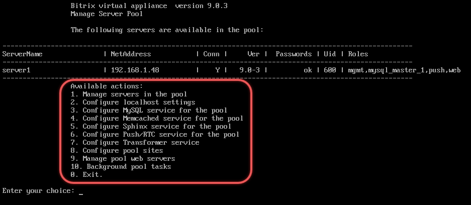
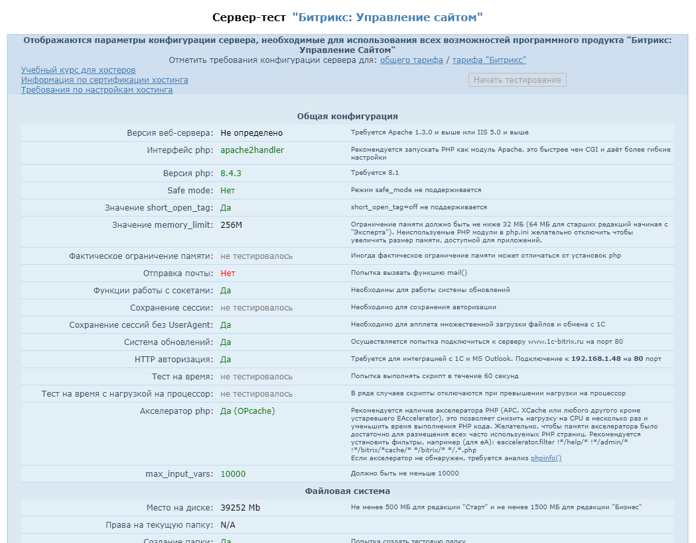

Перед началом работы с продуктами 1С-Битрикс необходимо настроить рабочее окружение. Компания 1С-Битрикс предлагает готовое окружение в нескольких вариантах:

-  BitrixVM -- виртуальный образ для быстрого старта.

-  BitrixEnv -- скрипт для настройки окружения на вашем сервере.

-  Облачные решения -- предустановленные образы для Amazon EC2.

## Виртуальная машина BitrixVM

Виртуальная машина BitrixVM --  это предустановленная виртуальная машина для быстрого запуска проектов на 1С-Битрикс. Готова к работе через несколько минут после развертывания. Поддерживает демо-версии продуктов и перенос существующих проектов.



[Список образов BitrixVM](https://www.1c-bitrix.ru/download/vmbitrix.php#tab-section-1)

[Запуск виртуальной машины BitrixVM](https://dev.1c-bitrix.ru/learning/course/index.php?COURSE_ID=37&LESSON_ID=29238)



## Окружение BitrixEnv для выделенного сервера

Если у вас есть выделенный сервер, вы можете установить необходимые пакеты и настроить окружение с помощью скрипта `bitrix-env-9.sh`

Поддерживаются операционные системы:

-  CentOS Stream 9

-  Rocky Linux 9

-  AlmaLinux 9

-  Oracle Linux 9

Используйте чистую операционную систему с официального сайта. Установка на кастомные сборки может вызвать ошибки.

### Установка на CentOS Stream 9

Рассмотрим установку окружения на примере операционной системы CentOS Stream 9. Установка на другие операционные системы выполняется аналогично, с учетом особенностей операционной системы.

1. Войдите под пользователем `root`.

2. Обновите пакеты.

   ```bash
   dnf clean all && dnf update
   ```

3. Установите утилиту `wget`, если ее нет на сервере.

   ```bash
   dnf install wget
   ```

4. Скачайте и запустите скрипт `bitrix-env-9.sh`.

   ```bash
   wget http://repo.bitrix24.tech/dnf/bitrix-env-9.sh && chmod +x bitrix-env-9.sh && ./bitrix-env-9.sh
   ```

5. Если SELinux включен, согласитесь на его отключение и перезагрузите сервер.

   ```bash
   reboot
   ```

6. После перезагрузки снова запустите скрипт и завершите установку.

   ```bash
   ./bitrix-env-9.sh
   ```

### Тихая установка

Установить BitrixEnv можно в тихом режиме, то есть без участия пользователя.  Укажите параметры в команде запуска скрипта, чтобы автоматически создать пул, включить Push-сервер и задать пароль для пользователя `root` MySQL.

Синтаксис команды запуска скрипта:

```bash
./bitrix-env-9.sh [-h] [-s] [-p [-H hostname]] [-P] [-t] [-M mysql_root_password] [-m 8.0|8.4]
```

Ключи:

-  `-s` -- использовать тихий режим, без запросов.

-  `-p` -- создать пул.

-  `-H` -- задать имя хоста для пула.

-  `-P` -- запустить Push-сервер.

-  `-t` -- использовать тестовую версию окружения

-  `-M` -- пароль пользователя root для MySQL.

-  `-m` -- установить Percona Server версии 8.0 или 8.4. По умолчанию -- 8.0.

-  `-h` -- показать справку

Пример команды:

```bash
./bitrix-env-9.sh -s -p -H server1 -P -m 8.4 -M 'BX123bx@#MYSQL'
# запустить установку окружения в тихом режиме
# запустить Push сервер и создать пул с именем хоста server1
# установить Percona 8.4 и задать пароль root для MySQL
```



Запуск push сервера (`-P`) при установке окружения сработает только в связке с созданием пула (`-p`).



## Amazon Elastic Compute Cloud

Amazon Elastic Compute Cloud (EC2) -- веб-сервис с масштабируемыми вычислительными мощностями для быстрого развертывания веб-приложений в облаках Amazon. Компания 1С-Битрикс подготовила настроенные AMI-образы BitrixVM для запуска продуктов в Amazon EC2.



[Список AMI-образов](https://www.1c-bitrix.ru/download/vmbitrix.php#tab-section-3)



## Управление окружением

Окружение BitrixEnv и виртуальная машина BitrixVM управляются через меню. Запустить меню можно командой `/root/menu.sh`.

Чтобы выбрать пункт меню, введите число и нажмите Enter. Для выхода из меню нажмите `0` или `Ctrl+C`.

{width=937px height=408px}

## Обязательные настройки окружения

1. Создайте пул сервера *1\. Create Management pool of server*. Это откроет порты для работы продуктов:

   -  22 -- ssh доступ.

   -  HTTP 80, HTTPS 443 -- Web-сервер.

   -  HTTP 8890, HTTPS 8891 -- NTLM.

   -  HTTP 8893, HTTPS 8894 -- сервер мгновенных сообщений.

2. Подключите Push-сервис для уведомлений *6\. Configure Push/RTC service*.



В BitrixEnv установите пароль для пользователя `bitrix` через меню *1\. Manage servers in the pool > 3. Change 'bitrix' user password*. В BitrixVM пароль указывается при первом запуске.



## Docker-образы

Официальные образы для Docker находятся в разработке и появятся позже. Вы можете использовать образы от сообщества разработчиков на [Docker Hub](https://hub.docker.com/search?q=bitrix).

## Кастомная настройка

Настроить окружение можно самостоятельно на основе CentOS Stream 9 или других операционных систем.



[Установка 1С-Битрикс: Управление сайтом и коробочной версии Битрикс24 на другие окружения](https://dev.1c-bitrix.ru/learning/course/index.php?COURSE_ID=135&CHAPTER_ID=020866).



Убедиться, что окружение настроено правильно, поможет скрипт [bitrix_server_test.php](https://dev.1c-bitrix.ru/download/scripts/bitrix_server_test.php). Разместить его на сервере можно командами:

```bash
cd /home/bitrix/www/ # переходим в корневую папку сайта
wget https://dev.1c-bitrix.ru/download/scripts/bitrix_server_test.php # скачиваем скрипт
```

Откройте страницу `bitrix_server_test.php` в браузере. Скрипт покажет параметры конфигурации сервера, необходимые для использования всех возможностей продукта.

{width=1049px height=820px}