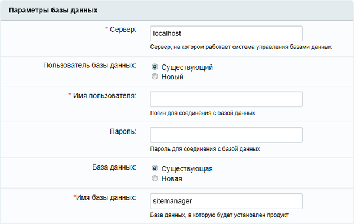
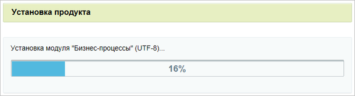
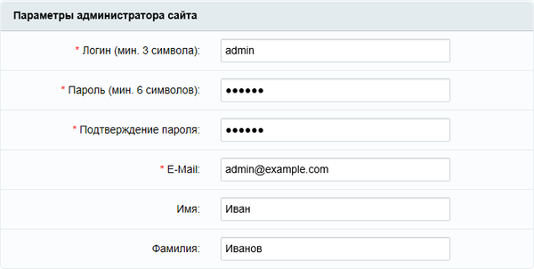

После подготовки окружения можно установить дистрибутив двумя способами.

1. **Использовать скрипт bitrixsetup.php.** Скрипт скачивает и распаковывает дистрибутив на сервере.

2. **Cкачать архив с официального сайта.** Архив с файлами дистрибутива выбранной редакции можно скачать и распаковать на сервере вручную.

## Скрипт bitrixsetup.php

1. Скачайте скрипт `bitrixsetup.php` в корневую папку сайта.

   
 

   В BitrixVM корневая папка дефолтного сайта находится по пути `/home/bitrix/www/`. Если сайтов несколько -- у каждого будет своя корневая папка. Например, `/home/bitrix/www/s1` для первого сайта и `/home/bitrix/www/s2` -- для второго.

   Далее установка показана на примере дефолтного сайта в BitrixVM.

   


   Для разных пользователей команды отличаются.

   -  Для пользователя `root`:

      ```bash
      cd /home/bitrix/www/ # переходим в корневую папку сайта
      wget https://www.1c-bitrix.ru/download/scripts/bitrixsetup.php # скачиваем скрипт
      chown bitrix:bitrix bitrixsetup.php # меняем владельца файла на пользователя bitrix
      
      ```

      Файл должен принадлежать пользователю, под которым работает веб-сервер. Поэтому меняем владельца файла на пользователя `bitrix` командой `chown`.

   -  Для пользователя `bitrix`:

      ```bash
      cd /home/bitrix/www/ # переходим в корневую папку сайта
      wget https://www.1c-bitrix.ru/download/scripts/bitrixsetup.php # скачиваем скрипт
      
      ```

2. Введите в браузере адрес сайта и путь к скрипту `http://[адрес_сайта]/bitrixsetup.php` .

3. Выберите продукт и лицензию. Для демонстрационной версии рекомендуем выбрать лицензию:

   -  бизнес -- для 1С-Битрикс: Управление сайтом,

   -  корпоративный портал -- для 1С-Битрикс24.

4. После загрузки запустится мастер установки продукта.

## Архив с сайта

Скачать дистрибутив можно с официального сайта:

-  [1С-Битрикс: Управление сайтом](https://www.1c-bitrix.ru/download/cms.php#tab-subsection-3)

-  [Коробочная версия Битрикс24](https://www.1c-bitrix.ru/download/intranet.php)

Разместите архив в корневой папке сайта на сервере. Чтобы скачать архив в папку `/home/bitrix/www/` используйте команды:

```bash
cd /home/bitrix/www/ # переходим в папку сайта
wget https://www.1c-bitrix.ru/download/business_encode.tar.gz # скачиваем дистрибутив по ссылке
```

Распакуйте скачанный архив. Чтобы распаковать архив в формате `.tar.gz`, выполните команду:

```bash
tar -xf business_encode.tar.gz
```

Откройте сайт в браузере. Запустится мастер установки.

## Мастер установки

Количество шагов в Мастере установки продукта отличается в разных вариантах установки. Например, в BitrixVM нет шага с проверкой системы.

### Лицензионное соглашение

Прочитайте Лицензионное соглашение. Чтобы продолжить установку, отметьте опцию *Я принимаю лицензионное соглашение*.

### Регистрация продукта

{width=733px height=291px}


**Лицензионный ключ.** Введите лицензионный ключ. Если вы хотите установить демоверсию, отметьте  опцию *Я хочу зарегистрировать копию и получать обновления* и заполните регистрационные поля.

**Установка для разработки.** Отметьте установку для разработки, чтобы работать в команде с одной копией продукта или предоставить каждому разработчику установку продукта для тестирования на одной лицензии.


 Подробнее в статье

[Установка для разработки](https://dev.1c-bitrix.ru/learning/course/index.php?COURSE_ID=135&LESSON_ID=8471)




### Проверка системы


 

Мастер пропускает шаг для BitrixVM.




Мастер проверяет настройки окружения для успешной работы продукта.

Результаты проверки отображаются цветами:

-  зеленый -- значения удовлетворяют требованиям системы,

-  красный -- значения не удовлетворяют требованиям системы.

{width=726px height=843px}


-  **Обязательные параметры.** Параметры, которым должна соответствовать система. Исправьте параметры, которые выделены красным цветом.

-  **Проверка доступа к диску.** Скрипты сайта должны иметь доступ на чтение и запись к файлам сайта.

-  **Рекомендуемые установки.** Параметры, которые обеспечат полную совместимость с требованиями продукта. Сайт будет работать, если некоторые параметры не соответствуют рекомендациям, но часть функционала может быть недоступна.

Проверить настройки позже можно в административном разделе на странице *Настройки > Инструменты > Проверка системы*.

### Параметры базы данных


 

Мастер пропускает шаг для BitrixVM.




Продукты поддерживают базы данных MySQL и PostgreSQL.

Заполните параметры базы данных.

{width=600px height=379px}


-  Сервер -- сервер, на котором работает СУБД.

-  Пользователь -- создайте нового или используйте существующего.

-  Имя пользователя -- логин для доступа к БД.

-  Пароль -- пароль для доступа.

-  База данных -- создайте новую или используйте существующую.

-  Имя базы -- латиница, цифры, символ `_`.

-  Права на файлы -- `0644` по умолчанию.

-  Права на папки -- `0755` по умолчанию.

Настройки БД можно изменить вручную после установки в файле `/bitrix/.settings.php`


 Установка на удаленном сервере или хостинге

Данные для подключения запросите запросите у службы поддержки удаленного сервера или  хостинга.




### Установка продукта

Мастер устанавливает продукт: создает таблицы в базе данных и копирует файлы системы.

{width=600px height=163px}

### Параметры администратора

Заполните поля, чтобы создать учетную запись администратора.

{width=600px height=302px}


-  Логин -- от 3 символов, латиница и цифры.

-  Пароль-- от 6 символов, латиница и цифры.

-  E-Mail -- электронная почта администратора.

-  Имя и Фамилия -- личные данные администратора.


 

Далее мастер настраивает решение. Установка решения описана в следующей статье.




## Быстрая установка

Быстрая установка пропускает первые шаги мастера и начинает установку продукта. Чтобы запустить быструю установку создайте файл `.settings.php` с настройками в папке `/bitrix/` дистрибутива.

Пример файла `/bitrix/.settings.php` с описанием настроек:

```php
<?php
return array (
    // настройки кодировки сайта
    'utf_mode' => array (
        'value' => true, // кодировка сайта, true для UTF-8
        'readonly' => true,
    ),
    // настройки кеширования
    'cache_flags' => array ( 
        'value' => array (
            'config_options' => 3600, // время кэширования настроек сайта в секундах
            'site_domain' => 3600, // время кэширования настроек домена
        ),
        'readonly' => false,
    ),
    // Параметры cookies
    'cookies' => array ( 
        'value' => array (
            'secure' => false, // использовать защищенное соединение HTTPS
            'http_only' => true, // разрешать доступ только через HTTP
        ),
        'readonly' => false,
    ),
    // настройки обработки ошибок
    'exception_handling' => array 
        'value' => array (
            'debug' => false, // режим отладки
            'handled_errors_types' => 4437, // типы обрабатываемых ошибок
            'exception_errors_types' => 4437, // типы исключений
            'ignore_silence' => false, // игнорировать @-оператор
            'assertion_throws_exception' => true, // преобразовывать assert в исключения
            'assertion_error_type' => 256, // тип ошибки для assert
            'log' => array ( // настройки логирования
                'settings' => array (
                    'file' => '/var/log/php/exceptions.log', // путь к лог-файлу
                    'log_size' => 1000000, // максимальный размер лога
                ),
            ),
        ),
        'readonly' => false,
    ),
    // Настройки подключения к базе данных
    'connections' => array (
        'value' => array (
            'default' => array (
                'className' => '\\Bitrix\\Main\\DB\\MysqliConnection', // драйвер БД
                'host' => 'localhost', // адрес сервера БД
                'database' => 'sitemanager0', // имя БД
                'login' => 'root', // пользователь БД
                'password' => '', // пароль пользователя
                'options' => 2, // дополнительные опции
            ),
        ),
        'readonly' => true,
    )
);
```

Параметр `readonly` определяет, можно ли менять настройки через API. Если `true` -- настройки изменить нельзя.