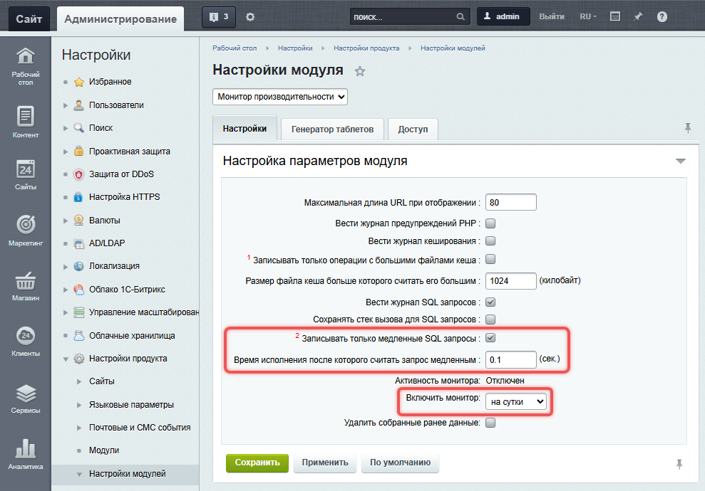
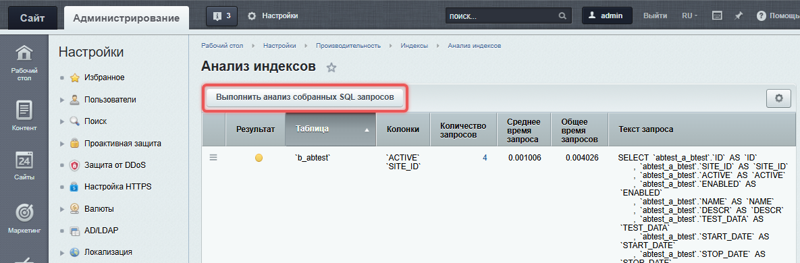
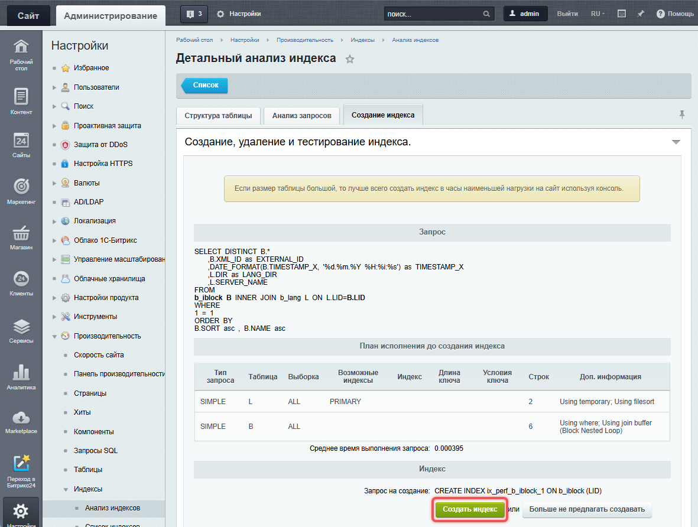
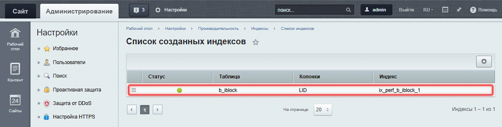

Оптимизация запросов к базе данных ускоряет работу сайта, снижает нагрузку на сервер и помогает избежать сбоев при высокой посещаемости. Даже небольшие улучшения могут значительно повысить производительность.

## Уменьшить количество запросов

Множественные запросы в цикле создают лишнюю нагрузку. Лучше собрать данные заранее и выполнить один запрос.

### Пример запроса для товаров

-  Неправильный подход: выполнить запрос в цикле. Для каждого товара в корзине выполняется отдельный запрос к базе данных. Это неэффективно, так как количество запросов растет с увеличением числа товаров.

   ```php
   foreach ($arResult["ORDERS"] as $key => $val) {
       foreach ($val["BASKET_ITEMS"] as $vvval) {
           $rsEls = CIBlockElement::GetByID($vvval["PRODUCT_ID"]); // Запрос в цикле
       }
   }
   ```

-  Правильный подход: собрать данные и выполнить один запрос. Сначала собрать все ID товаров в один массив. Затем выполнить один запрос к базе данных, чтобы получить данные всех товаров. Это значительно снижает нагрузку на сервер.

   ```php
   // Создаем массив для хранения ID товаров
   $arIDs = array();
   
   // Перебираем заказы и товары в корзине
   foreach($arResult["ORDERS"] as $key => $val) {
       foreach($val["BASKET_ITEMS"] as $vvval) {
           // Добавляем ID товара в массив
           $arIDs[] = $vvval["PRODUCT_ID"];
       }
   }
   
   // Если массив не пустой, выполняем один запрос
   if (!empty($arIDs)) {
       $rsEls = CIBlockElement::GetList(
           [],
           ["ID" => $arIDs],
           false,
           false,
           ["ID", "NAME"]
       );
   
   // Наполняем данные, используя ID
   foreach($arResult["ORDERS"] as $key => $val) {
       foreach($val["BASKET_ITEMS"] as $vvval) {
           // Работа с данными
       }
   }
   ```

## Использовать специализированные методы вместо универсальных

Универсальные методы подходят для широкого круга задач, но не учитывают их специфику. Это приводит к избыточному коду. Если есть специализированные методы для конкретных задач, используйте их. Специализированные методы уже содержат всю необходимую логику, что упрощает код и снижает вероятность ошибок.

Например, для изменения статуса оплаты заказа в модуле Интернет-магазин лучше использовать метод [\\Bitrix\\Sale\\Payment::setPaid](https://dev.1c-bitrix.ru/api_d7/bitrix/sale/classes/payment/setpaid.php), а не универсальный метод [\\Bitrix\\Sale\\Internals\\Entity::setFields](https://dev.1c-bitrix.ru/api_d7/bitrix/sale/classes/internals/entity/setfields.php). Это гарантирует вызов всех необходимых обработчиков, связанных с оплатой.

## Оптимизировать выборку данных

### Заменить метод GetByID на GetList

Метод [CIBlockElement::GetByID](https://dev.1c-bitrix.ru/api_help/iblock/classes/ciblockelement/getbyid.php) загружает все поля, даже если они не нужны. Используйте [CIBlockElement::GetList](https://dev.1c-bitrix.ru/api_help/iblock/classes/ciblockelement/getlist.php), указывая только необходимые поля.

```php
$rsEls = CIBlockElement::GetList(
    [],
    ["ID" => $arIDs],
    false,
    false,
    ["ID", "NAME"] // Указываем только необходимые поля
);
```

В примере указываем, какие поля нужно получить из базы данных. Это уменьшает объем обрабатываемых данных и ускоряет выполнение запроса.

### Оптимизировать основной запрос

Избегайте лишних запросов для получения связанных данных. Получайте все данные сразу, если это возможно.

```php
// Получаем данные о книгах и авторах одним запросом
$rs = CIBlockElement::GetList(
    ['ID' => 'ASC'],
    [
        'IBLOCK_ID' => YY, // ID инфоблока
        'ACTIVE' => 'Y'
    ],
    false,
    false,
    [
        'ID',
        'NAME',
        'PREVIEW_PICTURE',
        'PREVIEW_TEXT',
        'PROPERTY_AUTHOR.NAME', // Данные автора
        'PROPERTY_AUTHOR.PREVIEW_PICTURE' // Фото автора
    ]
);

// Сохраняем результаты
while($ar = $rs->GetNext()) {
    $arResult['ITEMS'][] = $ar;
}
```

## Использовать точные фильтры вместо LIKE

Фильтр `LIKE`  позволяет находить данные, которые частично совпадают с заданным значением. Фильтр использует специальный символ `%`, который заменяет любое количество других символов.

Если поиск по части строки не требуется, используйте вместо `LIKE` фильтры точного сравнения `=` или `where`. Это снизит нагрузку на сервер.

-  Пример фильтра `=`:

   ```php
   Bitrix\Iblock\ElementTable::getList([
       'select' => ['ID', 'NAME', 'CODE'],
       ['=CODE' => 'xxx']
   ]);
   ```

   В примере мы используем точный фильтр `['=CODE' => 'xxx']` и получаем данные только для элементов с конкретным значением поля `CODE`.

-  Пример фильтра `where`:

   ```php
   Bitrix\Iblock\ElementTable::query()
       ->setSelect(['ID', 'NAME', 'CODE'])
       ->where('CODE','xxx')->exec(); 
   ```

   Здесь фильтр `where('CODE', 'xxx')` отбирает элементы, у которых поле `CODE` равно `'xxx'`.

## Создать поисковые индексы

Поисковый индекс -- это структура данных, которая помогает базе данных быстрее находить нужную информацию. Без индексов поиск по большим таблицам может занимать много времени.

В каждом проекте медленные запросы зависят от структуры данных и частоты использования. Например, на сайте с большим количеством товаров медленным может быть запрос на поиск по цене и категории. В таких случаях помогает составной индекс, он создается сразу по нескольким полям таблицы.

### Как определить, какие индексы нужны

#### Настроить монитор производительности

Монитор производительности -- это инструмент, который помогает находить медленные  запросы SQL.

1. Откройте административный раздел сайта.

2. Перейдите в *Настройки > Настройки продукта > Настройки модулей > Монитор производительности.*

3. Включите опцию «Записывать только медленные SQL-запросы».

4. Укажите время, после которого запрос считается медленным. По умолчанию это 0,1 секунды.

5. Установите время работы монитора. Рекомендуем запускать его на одни сутки.

6. Нажмите «Сохранить». Запустится монитор производительности. Через сутки вы сможете проанализировать медленные запросы.

{width=989px height=690px}

#### Проанализировать результаты

После завершения работы монитора производительности:

1. Откройте административный раздел сайта.

2. Перейдите в *Настройки > Производительность > Индексы > Анализ индексов.*

3. Нажмите «Выполнить анализ собранных SQL-запросов».

{width=1185px height=390px}

В результатах обратите внимание:

-  на запросы с наибольшим временем выполнения,

-  запросы, которые выполняются чаще всего.

Не для каждого запроса нужно создавать индекс, так как это может увеличить нагрузку на базу данных. Иногда проблема в коде компонента. Например, если компонент делает слишком много запросов к базе данных, их можно оптимизировать.

### Как создать индекс

Чтобы создать индекс для конкретного запроса:

1. Перейдите в *Настройки > Производительность > Индексы > Анализ индексов.*

2. Выберите нужный запрос, откройте меню и нажмите «Детальный анализ». Откроется страница с детальным анализом запроса.

3. Перейдите во вкладку «Создание индекса» и нажмите «Создать индекс».

{width=1185px height=720px}

{width=1181px height=892px}

Созданный индекс появится на странице *Настройки > Производительность > Индексы > Список индексов.* Проверьте его эффективность, выполнив повторный анализ запросов.

{width=1186px height=301px}