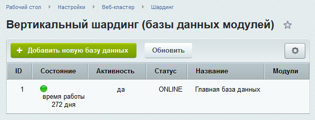
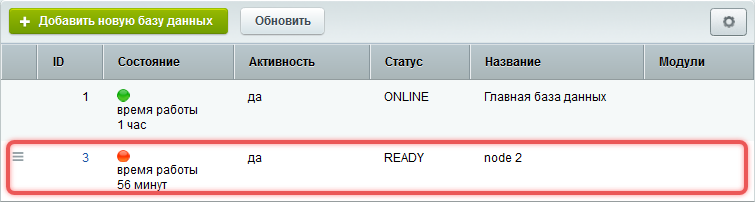
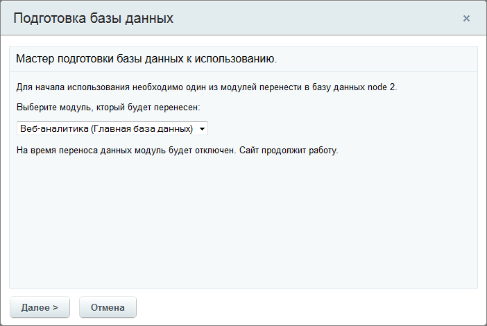

Шардинг -- это метод распределения данных между несколькими базами данных или серверами для повышения производительности системы. Он уменьшает нагрузку на основной сервер, разделяя данные и запросы между несколькими узлами. Если сайт обрабатывает тысячи запросов в секунду или хранит большие объемы данных, шардинг поможет распределить нагрузку и ускорить работу системы.

## Типы шардинга

-  **Вертикальный шардинг** позволяет разделить одну базу данных на несколько и вынести таблицы отдельных модулей на разные серверы. Логика работы приложения не меняется.

   Пример: вынести таблицы модуля Веб-аналитика на отдельный сервер, чтобы запросы к этим данным не замедляли работу основного сайта.

-  **Горизонтальный шардинг** позволяет распределить однотипные данные между несколькими базами данных. Для этого таблицы делятся на части и размещаются на разных серверах.

   Пример: разделить между несколькими базами данные всех пользователей. Например, пользователи с именами на буквы A-M хранятся в одной базе, а на N-Z -- в другой.



В «1С-Битрикс: Управление сайтом» и коробочной версии Битрикс24 доступен только вертикальный шардинг и только для модулей Веб-аналитика и Поиск.



## Как настроить шардинг

Чтобы перенести таблицы модулей Веб-аналитика и Поиск в отдельную базу данных:

1. Перейдите на страницу *Настройки > Веб-Кластер > Шардинг*.

2. Нажмите кнопку Добавить новую базу данных на контекстной панели. Откроется мастер добавления базы.

   {width=621px height=237px}

3. Пройдите все шаги мастера. Настройте параметры в соответствии с рекомендациями. Когда все параметры отмечены зеленым цветом, это означает, что база данных готова к использованию.

   {width=628px height=421px}

4. Укажите параметры подключения к базе данных.

   {width=628px height=421px}

После этого база появится в списке, но не будет работать. Чтобы база начала работать, перенесите в нее данные.

{width=755px height=202px}

## Как перенести данные

Перенести данные модуля в новую базу можно двумя способами:

-  воспользоваться мастером переноса данных -- этот способ доступен только для MySQL,

-  переустановить модуль.

### Способ 1: мастер переноса данных



Во время работы мастера переноса нельзя изменять текущие данные. Если вы переносите модуль Веб-аналитика, новые данные о посетителях сайта не будут сохраняться до завершения переноса.



1. В списке баз данных выберите нужную базу.

2. В меню действий выполните команду «Начать использовать». Запустится мастер переноса данных.

   {width=242px height=145px}

3. Выберите модуль для переноса и нажмите «Далее».

{width=702px height=470px}

### Способ 2: переустановка модуля



Таблицы с текущими данными модуля не будут перенесены автоматически. В новые таблицы будут сохраняться только новые данные.



1. Удалите модуль.

2. Установите его заново. На первом шаге установки укажите новую базу данных для модуля.

### Результат переноса данных

Индикатор состояния базы поменяет цвет на зеленый. Это значит, что база данных работает. В столбце Модули появится название подключенного модуля.

{width=755px height=202px}