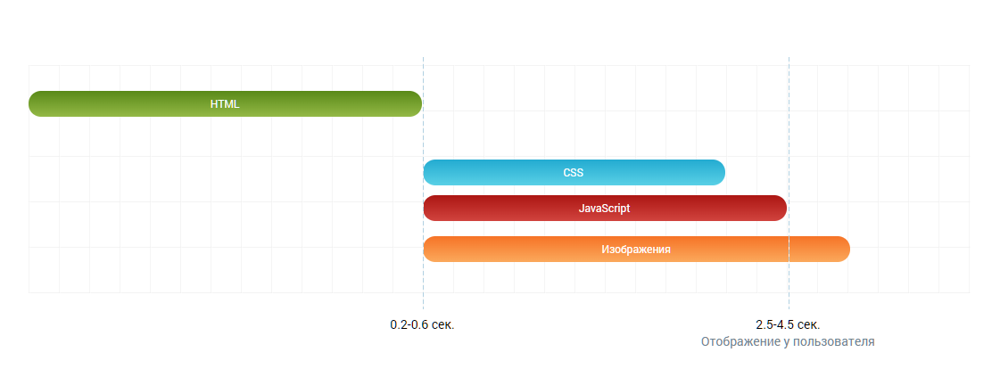
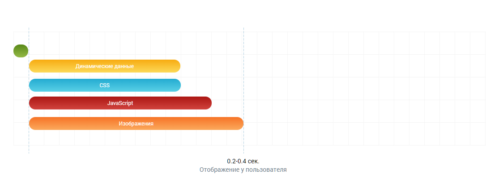
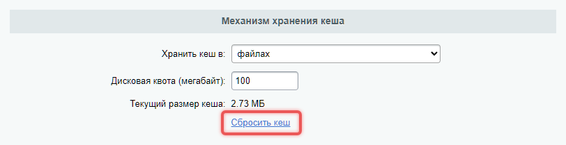

Композитный сайт -- это технология, которая ускоряет загрузку страниц и делает отображение контента гибким. Она работает как дополнительный уровень кеширования в Bitrix Framework.

Технология не конфликтует с другими механизмами кеширования. Она применяется после них, чтобы ускорить загрузку страниц за счет времени ответа сервера.

## Как работает технология

Композитный сайт разделяет статический и динамический контент. Динамический контент -- это данные, которые:

-  часто обновляются,

-  зависят от прав пользователя,

-  уникальны для каждого запроса.

Например, корзина интернет-магазина обновляется при добавлении товаров и показывает персональные скидки для каждого покупателя.

Статический контент загружается сразу, а динамический -- отдельным AJAX-запросом.

### Алгоритм работы без композитного сайта

1. Сервер получает запрос.

2. Проверяет права пользователя.

3. Выполняет PHP-скрипты компонентов.

4. Формирует HTML-код и отдает его браузеру.

В результате время загрузки страницы может достигать нескольких секунд.

{width=1121px height=423px}

### Алгоритм работы с композитным сайтом

1. **Разметка зон**. В шаблонах компонентов отмечаются зоны для динамического контента. Для этого используются специальные теги, например, `<div data-dynamic="true">`**.**

2. **Первичный запрос**. При первом запросе сервер создает кеш статической части страницы и добавляет JavaScript для загрузки динамического контента.

3. **Последующие запросы**. Сервер отдает кеш, а затем загружает динамический контент. JavaScript отправляет запрос на сервер, чтобы получить динамический контент, и вставляет его в нужные места на странице.

Для первого пользователя:

1. Сервер формирует страницу как обычно.

2. Сохраняет статическую часть в кеш.

3. Добавляет JavaScript для загрузки динамического контента.

Для последующих пользователей:

1. Сервер отдает кеш.

2. JavaScript загружает динамический контент в фоновом режиме.

В результате время загрузки страницы значительно сокращается благодаря кешированию статического контента, особенно для последующих пользователей. Динамический контент подгружается дольше, но пользователь этого не замечает.

{width=1115px height=409px}


## Как включить композитный сайт

Чтобы включить технологию Композитный сайт, настройте продукт и окружение.

В административном разделе продукта откройте страницу *Настройки > Настройки продукта > Композитный сайт*.

1. Выберите режим работы: Автокомпозит или Композит.

2. Нажмите кнопку включения на соответствующей вкладке.

3. Перед включением очистите кеш компонентов.

Для работы технологии необходимо настроить NGINX. NGINX -- это веб-сервер, который обрабатывает запросы к вашему сайту. Настройки зависят от окружения.

-  Виртуальная машина BitrixVM -- настройте NGINX через пункт меню *8\. Configure pool sites > 6. Configure nginx to use composite cache.*

   [Настройка nginx для работы с композитом](https://dev.1c-bitrix.ru/learning/course/index.php?COURSE_ID=37&CHAPTER_ID=029338)

-  Другое окружение **--** настройте NGINX для окружения вручную.

   [Установка 1С-Битрикс: Управление сайтом и коробочной версии Битрикс24 на другие окружения](https://dev.1c-bitrix.ru/learning/course/index.php?COURSE_ID=135&CHAPTER_ID=020866)

## Какой режим выбрать

-  **Автокомпозит.** Подходит для простых сайтов. В этом режиме система автоматически настраивает параметры, что экономит время разработки.

-  **Композит.** Ручная настройка рекомендуется для сложных проектов с кастомизированными компонентами. Автоматика может не учесть особенности вашего проекта, поэтому ручная настройка обеспечивает более гибкое управление.

### Автокомпозит

При выборе режима Автокомпозит система автоматически назначает следующие параметры:

-  Голосование шаблона компонента по умолчанию -- «за».

-  Содержимое компонента -- автоматически формируемая динамическая область с заглушкой.

-  Режим перезаписи кеша -- стандартный с задержкой.

Если сайт был настроен на ручной Композит, после включения Автокомпозита ранее адаптированные шаблоны и компоненты продолжают работать как раньше.

Чтобы проверить работу Автокомпозита:

1. Откройте сайт в режиме инкогнито как анонимный пользователь.

2. Зайдите на одну и ту же страницу несколько раз, чтобы проверить работу кеша.

3. Проверьте типовые сценарии пользователей. Убедитесь, что все страницы и компоненты работают корректно.

4. Измените параметры работы компонента в настройках компонента, если нужно. В компонентах доступно больше вариантов заглушек, чем в глобальных настройках.

В режиме Автокомпозит для разметки динамических областей используются невидимые теги вместо `div-контейнера`. Теги не влияют на верстку.

```html
// разметка до включения Автокомпозита
<div id="bxdynamic_area_id">
   Контент заглушки
</div>

// разметка после включения Автокомпозита
<div id="bxdynamic_area_id_start" style="display:none"></div>
   Контент заглушки
<div id="bxdynamic_area_id_end" style="display:none"></div>
```

Если компонент не работает в Автокомпозите

-  Проверьте инициализацию кода на событие `DOMContentLoaded`. Перенесите `BX.ready` или `$.ready` в динамическую область.

-  Проверьте Обработчики глобальных событий браузера.

-  Убедитесь, что в динамической области не используются функция `insertAdjacentHTML` и отложенные функции.

### Композит

В этом режиме можно настраивать глобальные параметры.

-  Голосование компонентов -- определяет, какие компоненты будут обновляться динамически.

-  Тип заглушки для динамических зон -- временный контент, который показывает система во время загрузки динамической части.

Страницы, которые зависят от действий пользователя и часто обновляются, не стоит кешировать. Например, рекомендуем оставить динамическими:

-  страницу поиска, компонент `bitrix:search.page`,

-  корзину с оформлением, компонент `bitrix:sale.basket.order.ajax`,

-  страницу оформления заказа, компонент `bitrix:sale.order.ajax`.

## Как настроить композитный сайт

Настроить композитный сайт можно в административном разделе продукта на странице *Настройки > Настройки продукта > Композитный сайт*, вкладка Настройки.

{width=1303px height=820px}


 

Файл настроек `.config.php` находится в папке `/bitrix/html_pages/`. Не редактируйте его вручную -- изменения будут перезаписаны при сохранении настроек через интерфейс.




### Голосование за композитный режим

Настройка доступна только для режима Композит. Определяет, какие компоненты будут обновляться динамически.

1. За -- все компоненты по умолчанию будут обновляться динамически.

2. Против -- включите вручную обновление в нужных компонентах.

Данные этого параметра можно переопределить в настройках компонента.

### Режим перезаписи кеша

Выберите один из трех способов обновления кеша:

1. **С задержкой.** Снижает нагрузку на систему, распределяя процесс обновления кеша во времени.

2. **Без задержки.** Кеш обновляется сразу после изменения данных.

3. **Без фонового AJAX-запроса (HTML-кеширование).** После получения страницы клиентом, JS-скрипт сравнивает дату изменения кеша с временем пользователя. Если разница превышает установленное значение, кеш перезаписывается. Рекомендуется для страниц с высокой посещаемостью, таких как лендинги или сайты-визитки. Только для режима Композит.

Управлять режимом можно через API.

```php
$composite = \Bitrix\Main\Page\Frame::getInstance();

// Отключаем AJAX-запрос
$composite->setAutoUpdate(false);

// Устанавливаем время обновления кеша — 60 секунд
$composite->setAutoUpdateTTL(60);
```

### Настройки

#### Включение технологии по сайтам

Чтобы включить технологию для конкретных сайтов укажите доменные имена в поле *Список доменных имен*. Проверка домена выполняется по полному совпадению. Убедитесь, что в списке указаны все варианты домена, с `www` и без.


 

Не удаляйте номер порта из доменного имени, если сайт работает на 1С-Битрикс: Веб-окружение.




#### Игнорирование параметров URL

Для страниц с разными параметрами можно создать единый кеш. Это уменьшает его размер. Параметры указываются в поле *Игнорировать следующие параметры URL.*

Например, пользователь открывает страницу: `/index.php?event1=download&event2=bsm_API`. Если добавить параметры `event1` и `event2` в исключения, отдельный кеш для такой страницы система создавать не будет, только для `/index.php`.

Службы Веб-аналитика, Google Аналитика и Яндекс Метрика будут корректно работать с такими кешированными страницами.

#### Сохранение кеша только для страниц без параметров

Опция *Сохранять на диск только страницы без параметров* включит создание кеша только для страниц с ЧПУ (человекопонятный URL). Для страниц с параметрами кеш не создастся, например, для постраничной навигации.

Добавить в исключение некоторые параметры можно в поле *А также страницы, содержащие только следующие параметры*.

### Механизм хранения кеша

**Файлы.** Укажите объем места для хранения кеша в поле *Дисковая квота*.

-  В файлах можно хранить большой объем. При достижении лимита старый кеш автоматически удаляется по алгоритму LRU (Least Recently Used).

-  Кеш сохраняется после перезагрузки сервера.

-  Работает медленнее, чем кеш в оперативной памяти.

**Оперативная память (memcached).** Укажите адрес и порт сервера.

-  Имеет небольшой объем памяти.

-  Требует установленного PHP-расширения `memcached`

-  При перезагрузке сервера кеш очищается.

-  При нехватке памяти кеш сбрасывается.

-  Кеш в оперативной памяти работает быстро.

### Группы

На вкладке выбираются группы пользователей, для которых будет срабатывать композитный режим. Чтобы композитный режим работал у пользователя, он должен:

-  принадлежать хотя бы одной из указанных групп,

-  не входить в те группы, что не указаны на вкладке.

**Пример.** Пользователь состоит в трех группах:

-  пользователи, имеющие право голосовать за рейтинг,

-  зарегистрированные пользователи,

-  пользователи, имеющие право голосовать за авторитет.

Во вкладке указана одна группа -- Зарегистрированные пользователи. Композитный режим не будет работать для пользователя.

{width=596px height=311px}


Чтобы режим работал,  укажите все три группы или исключите пользователя из ненужных групп.

{width=534px height=306px}


 

Кеширование административной панели -- признак неправильной настройки групп. Группы, которым доступна административная панель, не должны быть в списке для композитного режима.




### Кнопка «Быстро с 1С-Битрикс»

Кнопка «Быстро с 1С-Битрикс» отображается в правом нижнем углу страниц при включении технологии Композитный сайт. Внешний вид кнопки можно настроить на вкладке *Кнопка «Быстро с 1С-Битрикс»*.

Кнопка работает как индикатор быстроты загрузки страницы. Она отобразится, если время загрузки страницы соответствует критериям композита. Отсутствие кнопки -- признак проблем с производительностью, например, ошибок в коде или  в архитектуре проекта.

Чтобы переместить кнопку, добавьте в шаблон сайта область с `id="bx-composite-banner"`.

## Префикс файлов cookies

Композитный сайт можно включить для определенных групп пользователей. Различить пользователей помогают префиксы cookies:

-  `BITRIX_SM_NCC` -- для пользователей без композитного кеша,

-  `BITRIX_SM_CC` -- для пользователей с композитным кешем.

Префикс `BITRIX_SM` установлен по умолчанию в настройках Главного модуля в поле *Имя префикса для названия cookies (без точек и пробелов)*. Если изменить это значение, композитный кеш перестанет корректно работать для администраторов.

Не рекомендуется изменять префикс BITRIX_SM. Если это необходимо, внесите изменения в настройки NGINX.

1. В конфигурационном файле сервера замените конструкции `$cookie_BITRIX_SM_***`

   на `$cookie_Новый_префикс_***`.

2. Убедитесь, что в файле `/bitrix/html_pages/.config.php` указаны правильные префиксы в ключах:

   -  `COOKIE_LOGIN`

   -  `COOKIE_PASS`

   -  `COOKIE_NCC`

   -  `COOKIE_CC`

   -  `COOKIE_PK`

## Как проверить работу композитного сайта

1. **Список закешированных страниц и статистика.** Список всех сохраненных кешей страниц находятся в разделе *Настройки > Настройки продукта > Композитный сайт > Страницы*.

   -  Просмотры -- показывает популярность страниц.

   -  Перезапись -- большое число перезаписей указывает на проблемы: частое обновление контента или ошибки в настройках.

2. **Кнопка «Быстро с 1С-Битрикс».** Когда кнопка отображается на странице -- композитный кеш работает. Если в шаблоне сайта нет кнопки, вы можете временно добавить ее.

3. **Плагин для разработчика.** Упростить проверку помогает [плагин для Chrome](https://chrome.google.com/webstore/detail/bitrix-composite-notifier/bhjmmlcdfdcdloebidhnlgoabjpbfjbk). Он показывает:

   -  работает ли сайт на Композите,

   -  обновляется ли кеш при фоновом AJAX-запросе,

   -  есть ли ошибки на страницах.

   Если значок плагина -- зеленый, композитный кеш работает корректно.

## Как выполнить отладку композитного сайта

Основной инструмент отладки -- страница *Настройки > Настройки продукта > Композитный сайт > Отладка*. Здесь ведется логирование всех ошибок работы композитного кеша.

По умолчанию инструмент отладки отключен. Чтобы включить его:

1. укажите время работы отладки,

2. включите отладку.

Чтобы проверить страницы сайта самостоятельно, зайдите на них под пользователем, для которого работает композитный кеш. В списке отобразятся страницы, которые не смогли создать кеш.

### Информация для отладки

#### Тип события

Причина, по которой страница попала в список. Возможные ошибки и их решения:

1. **Перезапись кеша** -- частая ошибка, вызванная обновлением контента или системы.

   Решение: проверить частоту обновлений контента.

2. **Голосование компонента «Против»** -- компонент не поддерживает композитный режим.

   Решение: адаптировать компонент (неактуально для Автокомпозита).

3. **Вызов RestartBuffer** -- метод `RestartBuffer` используется на страницах, которые не должны кешироваться.

   Решение: убрать вызов `RestartBuffer`, если страница должна кешироваться.

4. **Сброс кеша** -- кеш сброшен из-за обновления контента или системы.

   Решение: действия не требуются, если сброс происходит редко

5. **Не GET-запрос** -- композитный режим работает только с GET-запросами.

   Решение: убедиться, что запросы выполняются методом GET.

6. **Параметр** `ncc` -- параметр URL `ncc` запрещает кеширование.

   Решение: удалить параметр `ncc`, если он добавлен вручную.

7. **Cookie** `_NCC` -- служебная cookie `_NCC` (No Composite Cache) запрещает кеширование.

   Решение: настроить группы пользователей.

8. **Маска исключения** -- страница добавлена в поле «Маска исключения» в настройках композита.

   Решение: удалить страницу из списка исключений.

9. **Параметр исключения** -- в URL страницы присутствует параметр из списка исключений.

   Решение: удалить параметр из списка исключений.

10. **Неверный домен** -- домен не указан в поле «Список доменных имен».

    Решение: добавить домен в список.

11. **Неверный параметр запроса** -- параметр отсутствует в списке разрешенных параметров.

    Решение: добавить параметр в список разрешенных.

12. **Локальный редирект** -- внутренний редирект (например, короткие ссылки).

    Решение: убедиться, что редиректы не мешают кешированию.

13. **Административная панель** -- кеш не применяется к страницам с административной панелью.

    Решение: это правильное поведение, действия не требуются

14. **Аварийное завершение PHP (**`die`**)** -- кеш не создан из-за вызова `die` или `exit`.

    Решение: убрать вызовы `die` или `exit`.

15. **Страница против кеширования** -- установлен запрет на кеширование страницы.

    Решение: удалить запрет на кеширование.

16. **Композитный Javascript не внедрен** -- проблемы с внедрением JS.

    Решение: проверить код и устранить ошибки.

17. **Cookie** `_CC` **не найдена** -- отсутствует cookie композитного кеша `_CC`.

    Решение: настроить группы пользователей.

18. **Параметр** `sessid` -- в запросе есть сохраненная авторизация.

    Решение: убедиться, что параметр `sessid` не мешает кешированию.

19. **Ajax-запрос** -- запрос выполнен через `BX.ajax`.

    Решение: Ajax-запросы не кешируются.

20. **Директория** `/bitrix` -- административный раздел по умолчанию исключен из кеширования.

    Решение: это правильное поведение, действия не требуются.

21. **Файл** `index-controller.php` -- адрес запрещен для кеширования.

    Решение: это правильное поведение, действия не требуются.

#### Пользователь

Логин пользователя, обращение которого не создало кеш. Поможет определить, как композитный сайт работает для групп пользователей.

#### Сообщение

Содержит дополнительную информацию для расширенной отладки. Может показывать название компонента, путь к шаблону компонента или ссылку *Сравнить версии* для страниц с перезаписью.

Ссылка *Сравнить версии* открывает инструмент, который сравнивает код старой и новой версии страниц.

{width=973px height=473px}

Инструмент выделяет:

-  зеленым -- добавленный код,

-  красным -- удаленный код.

По ссылке *исходный код* можно скачать полный код страницы для детального анализа.

### Рекомендации для отладки

-  В период отладки система создает много файлов с расширением `.delete.<microtime>`. Они быстро расходуют место на диске. Увеличьте место для хранения кеша на время отладки, либо периодически очищайте кеш.

-  Параметр `ncc=1` в URL отменяет использование композитного кеша. Этот параметр можно использовать при отладке. Если нужны собственные исключающие параметры, используйте `~EXCLUDE_PARAMS` в файле `.config.php`.

-  После завершения отладки отключите константу `BX_COMPOSITE_DEBUG`, чтобы избежать излишнего использования места на диске.

-  После внесения изменений на сайте проверяйте лог на наличие ошибок.

## Как адаптировать переменные

При переходе на Композитный сайт замените с PHP на JavaScript переменные:

-  `bitrix_sessid_get`

-  `USER_ID`

-  `SERVER_TIME`

-  `SERVER_TZ_OFFSET`, `USER_TZ_OFFSET`, `USER_TZ_AUTO`

Замените их на `BX.message`. Например, для `bitrix_sessid_get` используйте  `BX.message('bitrix_sessid')` или `BX.bitrix_sessid()`.

Данные будут получены с сервера или из локального хранилища, если это не первый визит.

1. Система ищет данные в сообщениях `BX.message`.

2. Если данных нет -- проверяет локальное хранилище.

3. Если данных нет нигде, выполняется синхронный запрос. Он блокирует выполнение страницы до получения данных.

### Серверные переменные

Не используйте серверные переменные в шаблонах компонентов, например, переменную `$_SERVER['HTTP_USER_AGENT']`. Это может вызвать проблемы, например, перезапись HTML-файлов из-за разных контрольных сумм для браузеров. Обрабатывайте такие данные в PHP-коде компонента, а не в шаблоне.

### Функция bitrix_sessid_post

Функция `bitrix_sessid_post` генерирует в HTML скрытое поле `hidden` с хешом от `ID` сессии пользователя для защиты форм от CSRF-атак. С композитом это невозможно, так как HTML-код кешируется и должен быть одинаковым для всех пользователей.

В режиме Композитного сайта функция возвращает пустое значение `value`. Реальное значение устанавливается через JavaScript. Это нужно для корректной работы кеширования, так как значение `bitrix_sessid` может быть разным для разных пользователей.

При использовании форм на страницах с Композитным сайтом, убедитесь, что `bitrix_sessid_post` корректно обрабатывается. Иначе формы могут потерять защиту от CSRF.

## Как работать с динамическими зонами

### В компонентах

-  Используйте метод `setAnimation` для плавного появления контента.

-  Убедитесь, что динамичные части не вложены друг в друга.

Пример кода:

```php
$frame = $this->createFrame("top_banner")->begin();

$frame->setAnimation(true); // Включает плавное появление контента
// Здесь размещается динамический контент

$frame->end();
```

### В шаблоне сайта

Если нужно создать динамическую зону вне компонента, например в `header.php`, используйте методы `startDynamicWithID` и `finishDynamicWithID`:

```php
\Bitrix\Main\Page\Frame::getInstance()->startDynamicWithID("area"); // Начало динамической зоны

// Здесь размещается динамический контент вне компонента

\Bitrix\Main\Page\Frame::getInstance()->finishDynamicWithID("area", ""); // Завершение динамической зоны
```

Буферизация позволяет управлять заглушками и разделять логику основного контента и заглушки.

```php
$frame = new \Bitrix\Main\Page\FrameBuffered("my_dynamic_area"); // Создание буферизированной зоны

$frame->begin(); // Начало динамической зоны
   // Здесь размещается динамический контент

$frame->beginStub(); // Начало заглушки
   // Здесь размещается контент заглушки

$frame->end(); // Завершение динамической зоны
```

### Как избежать мерцания в динамической зоне

Эффект мерцания возникает, когда пользователь видит заглушку перед загрузкой актуальных данных. Например, счетчик товаров в корзине сначала показывает `0`, а затем обновляется.

1. В кеш записывается заглушка. Например, `0 товаров`.

2. Пользователь видит страницу с заглушкой.

3. Даже если AJAX-запрос выполняется быстро, пользователь продолжает видеть заглушку.

Возможные решения:

1. **Использовать** `insertAdjacentHTML`. JS-метод вставляет HTML-код в указанное место без остановки рендеринга страницы.

   ```javascript
   document.getElementById("container").insertAdjacentHTML(
       "beforeend", // Вставка в конец элемента
       '<div id="box">Загрузка...</div>'
   );
   ```

2. **Разместить JavaScript после HTML**. Если разместить JavaScript сразу после элемента, он обновится до отображения страницы.

   ```html
   <div id="box" style="width: 100px; height: 100px; background: red;"></div>
   <script>
       document.getElementById("box").style.background = "blue";
   </script>
   ```

3. **Использовать** `localStorage`. Данные из `localStorage` доступны мгновенно. Используйте `BX.localStorage` для работы с локальным хранилищем.

   ```javascript
   BX.localStorage.set("cart_count", 5); // Сохранение данных
   var count = BX.localStorage.get("cart_count"); // Получение данных
   
   /* 
   События localStorage:
    onLocalStorageSet — при сохранении данных.
   onLocalStorageRemove — при удалении данных.
   onLocalStorageChange — при изменении данных.
   */
   ```

## Как работать с JS в Композитном сайте

Технология Композитный сайт не ограничивает использование языка JS. Однако при повторном запросе часть DOM изменяется. Это может привести к потере событий, привязанных к динамическим зонам из внешних файлов. После вставки динамической зоны нужно заново инициализировать все обработчики.

### Отключить автоматическое обновление

Если нужно самостоятельно управлять обработкой динамических зон, автоматическое обновление можно отключить с помощью метода `setAutoUpdate`.

```javascript
$frame->setAutoUpdate(false);
```

Отключение работает для любой динамической области на странице.

Указать время жизни кеша можно методом `setAutoUpdateTTL`.

### События для работы с динамическими зонами

Чтобы выполнить действия после обновления DOM, например, навешивание или перевешивание обработчиков событий, используйте события:

1. `onFrameDataReceivedBefore` -- происходит перед началом цикла вставки динамических блоков.

   ```javascript
   BX.addCustomEvent("onFrameDataReceivedBefore", [json]); 
   // json — все данные, полученные в композитном AJAX-запросе.
   ```

2. `onBeforeDynamicBlockUpdate` -- происходит перед вставкой каждого блока.

   ```javascript
   BX.addCustomEvent("onBeforeDynamicBlockUpdate", [block, fromCache]); 
   /* 
   block — данные конкретного блока: id, контент и другие параметры.
   fromCache — равен true, если данные вставляются из локальной SQL-базы.
   */
   ```

   Вставка не происходит, если для зоны указано `$frame->setAutoUpdate(false)`.

3. `onFrameDataReceived` -- происходит после завершения цикла вставки динамических блоков.

   ```javascript
   BX.addCustomEvent("onFrameDataReceived", [json]);
   // json — все данные, полученные в композитном AJAX-запросе.
   ```

### Узнать режим работы страницы

Узнать в каком режиме загрузилась страница можно с помощью глобальной переменной `window.frameCacheVars`. Она содержит данные, необходимые для работы композитного режима. Так можно определить, что необходимый блок загрузился, и начать работу с ним сразу после загрузки страницы.

```javascript
if (window.frameCacheVars !== -->) { // Проверяем, работает ли страница в композитном режиме
    BX.addCustomEvent("onFrameDataReceived", function(json) {
        Working(); // Выполняем функцию Working после загрузки динамических данных
    });
} else {
    BX.ready(function() {
        Working(); // Выполняем функцию Working после полной загрузки страницы
    });
}
```

Кроме `window.frameCacheVars`, можно использовать переменную `window.frameRequestStart`. Она помогает определить момент начала запроса данных для динамических блоков.

## Заголовки и 304 ответ

При отдаче страницы из кеша или в ответе на AJAX-запрос добавляется заголовок `X-Bitrix-Composite` со значениями:

-  `Cache (200)` -- страница отдана из композитного кеша.

-  `Cache (304)` -- страница отдана из композитного кеша, 304 ответ.

-  `Ajax` -- ответ на композитный AJAX-запрос.

-  `Ajax (stable)` -- кеш не изменился.

-  `Ajax (changed)` -- кеш изменился на этом хите.

-  `Ajax (error:not_cacheable)` -- страница не может быть закеширована.

-  `Ajax (error:redirect)` -- выполнен редирект.

-  `Ajax (error:not_injected)` -- композитный JS не записался в кеш.

Когда страница отдается из кеша, сервер добавляет заголовок `Last-Modified` с датой последнего изменения. Дальше процесс выглядит так:

1. **Первый хит.** Сервер создает композитный кеш и передает заголовок `Last-Modified`.

2. **Второй хит.** Браузер запрашивает страницу с заголовком `If-Modified-Since`, чтобы проверить, изменилась ли она.

3. **Третий хит.** Если страница не изменилась, сервер отвечает кодом `304`, и браузер использует локальный кеш.

Ответ `304` уменьшает нагрузку на сервер и экономит лимиты индексации поисковиков.

## Как обработать неудачный запрос

Если AJAX-запрос завершился неудачно, страница может отобразиться без динамического контента. Для обработки таких ситуаций используйте событие `onFrameDataRequestFail`.

```javascript
BX.addCustomEvent("onFrameDataRequestFail", function(response) {
  /*
     response.error = true // указывает на ошибку запроса
     response.reason // причина ошибки
     [response.url] // адрес запрашиваемой страницы
     [response.xhr] // объект XMLHttpRequest
     [response.status] // код ответа сервера
     [response.response] // ответ сервера
  */
  window.location = "/some/url/?ncc=1"; // перенаправляем пользователя на страницу с выключенным композитом ncc=1
```

## Частая перезапись кеша

Страницы могут перезаписываться слишком часто, даже если динамический контент не изменяется.

В папке кеша `/bitrix/html_pages/<domain>/` файлы перед перезаписью копируются с расширением `*.delete.<microtime>`. Это позволяет сравнить старую и новую версии страницы.

### Типовые причины

1. **Использование случайных идентификаторов** -- например, `ID` сессии или JS-объектов.

   Решение: использовать метод `$this->randString($len=6);` для генерации уникальных идентификаторов.

2. **Разный контент для разных браузеров**

   Решение: убедиться, что контент не зависит от браузера.

3. **Подстановка** `REQUEST_URI` -- например, в `form[action]` или `back_url`.

   Решение: раздел `site.ru/folder/` и индексная страница раздела `site.ru/folder/index.php` должны использовать один файл кеша.

4. **Не все динамичные зоны выделены**

   Решение: проверить, что весь динамичный контент находится в динамичных зонах.

5. **Использование данных из сессии** -- например, `id`, `login` пользователя.

   Решение: убедиться, что такие данные не влияют на кеш.

6. **Разный контент для авторизованных и анонимных пользователей.**

   Решение: контент не должен зависеть от авторизации.

7. **Добавление CSS и JS в зависимости от пользователя.**

   Решение: ресурсы должны добавляться одинаково для всех пользователей.

### Переменные данные в head

Если компонент добавляет CSS или JS в `<head>` по условию, это вызывает частую перезапись кеша. Добавлением ресурсов управляет метод `Bitrix\Main\Page\AssetMode::setAssetMode`. Метод принимает один из режимов:

-  `AssetMode::STANDARD` -- ресурсы добавляются стандартным образом.

-  `AssetMode::NO_ASSETS` -- ресурсы не добавляются в `<head>`.

```javascript
$dynamicArea = new \Bitrix\Main\Page\FrameStatic("workarea");

$dynamicArea->setAssetMode(AssetMode::STANDARD); // Устанавливает режим добавления ресурсов

$dynamicArea->setStub("заглушка"); // Устанавливает заглушку

$dynamicArea->startDynamicArea(); // Начало динамической зоны
   // Компонент, который добавляет ресурсы в <head>
$APPLICATION->includeComponent("mycompany:mycomponent", "template", array());
$dynamicArea->finishDynamicArea(); // Завершение динамической зоны
```

1. `setAssetMode(AssetMode::STANDARD)` -- разрешает добавление ресурсов в `<head>` стандартным образом.

2. `setStub("заглушка")` -- задает заглушку для динамической зоны.

3. `startDynamicArea()` **и** `finishDynamicArea()` -- выделяют область, где можно безопасно добавлять ресурсы без лишней перезаписи кеша.

### Блок PHP в head

PHP-код в блоке `<head>`, который проверяет cookie и добавляет стили, вызывает перезапись кеша. Логику лучше вынести в JavaScript.

```html
<head>
    <script>
        if (document.cookie.indexOf("my_cookie=yes") >= 0) {
            // Устанавливаем класс для тега <html>
            document.documentElement.className += " has-cookie";
        }
    </script>
    <style>
        .block {
            display: none;
        }
        .has-cookie .block {
            display: block;
        }
    </style>
</head>Случайные строки
```

При генерации страницы со случайной строкой создается новый уникальный идентификатор, и кеш считается измененным.

Метод `$this->randString()` генерирует стабильный идентификатор, который не меняется между запросами для одной и той же страницы. Это позволяет избежать частой перезаписи кеша.

```php
$id = $this->randString(); // Генерация стабильного идентификатора
```

## Как сбросить кеш

При изменении шаблона сайта рекомендуется сбрасывать композитный кеш. Сделать это можно через настройки в продукте, cron или API.


 

Не рекомендуем удалять папку с кешем `/bitrix/html_pages/<domain>/` вручную. Это может привести к ошибкам, если до сброса кеша была превышена квота. Если вы удалили папку -- очистите файл `bitrix/html_pages/.enabled`, чтобы сбросить статистику.




1. **Через настройки в продукте.** Используйте ссылку *Сбросить кеш* на странице настроек Композитного сайта.

   {width=812px height=209px}

2. **Через cron.** Чтобы сбросить кеш через cron используйте файл `cron_html_pages.php` . Он находится по пути `path_to_site/bitrix/modules/main/tools/cron_html_pages.php`.

   Пример команды для удаления кеша старше 10 часов:

   ```bash
   php -f /path_to_site/bitrix/modules/main/tools/cron_html_pages.php 10
   ```

3. **Через API.** Для сброса кеша с помощью API можно использовать метод `\Bitrix\Main\Data\StaticHtmlCache`.

   ```php
   $staticHtmlCache = \Bitrix\Main\Data\StaticHtmlCache::getInstance();
   $staticHtmlCache->deleteAll();
   ```

## Особенности работы с кешем

### Кеш в хранилище браузера

Для хранения данных в локальном хранилище браузера используйте метод `setBrowserStorage(true)`.

```javascript
$frame = $this->createFrame()->begin(); // Создание динамической зоны
$frame->setBrowserStorage(true); // Включает использование локального хранилища браузера
// Здесь размещается динамический контент
$frame->end(); // Завершение динамической зоны
```

### Полное кеширование шаблона компонента

Если нужно кешировать весь контент шаблона и обновлять его на втором хите, поместите код шаблона в `createFrame()->begin()`.

```javascript
$frame = $this->createFrame()->begin(); // Начало динамической зоны для всего шаблона
   // Весь контент шаблона
$frame->end(); // Завершение динамической зоны
```

### Отмена композита в любой части страницы

Метод `markNonCacheable` отменяет композитный режим для страницы.

```php
\Bitrix\Main\Data\StaticHtmlCache::getInstance()->markNonCacheable();
```

## Композит в системах аналитики

Google Analytics и Яндекс Метрика собирают данные на основе Navigation Timing. Композитный сайт влияет только на время ожидания ответа от сервера Server Response Time и не влияет:

-  на DNS lookup,

-  TCP-соединение,

-  загрузку JS, CSS и изображений.

Используйте глобальную переменную `window.frameRequestStart`, чтобы определить, была ли страница отдана из композитного кеша.

```javascript
var _gaq = _gaq || [];
_gaq.push(['_setAccount', 'UA-18655900-1']);
_gaq.push(['_setCustomVar', 1, 'Cache', window.frameRequestStart ? 'Composite' : 'NoComposite', 3]);
```


 

Код для Google Analytics должен располагаться ниже кода, выполняющего фоновый композитный запрос.


