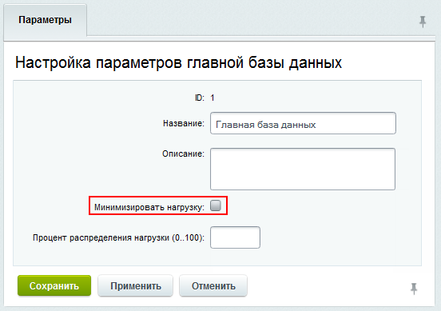

Репликация базы данных -- это процесс, при котором создается копия базы данных и поддерживается ее актуальность. Это значит, что все изменения в основной базе данных автоматически передаются в копию.

Репликация позволяет:

-  разгрузить основную базу данных, распределяя запросы между копиями,

-  иметь резервную копию, которая всегда готова к использованию,

-  работать с несколькими базами данных, расположенными в разных географических точках. Это повышает скорость доступа к данным.

## Master-Slave репликация

Подключение дополнительных серверов баз данных снижает нагрузку на основную базу. Чтение данных происходит из копий `slave`, а запись -- в основную базу `master`.


 

С версии 24.0.0 Главного модуля вся нагрузка может быть перенаправлена на slave-серверы.

1. До первого запроса на изменение данных система работает в обычном режиме.

2. При запросе на изменение фиксируется список измененных таблиц.

3. При последующих запросах выборки проверяется, изменялись ли таблицы. Если нет, запросы продолжают обрабатываться через slave-серверы.




При использовании нескольких веб-серверов в файле `/bitrix/.settings.php` на всех серверах должен быть указан адрес подключения к главной базе данных. Необходимо использовать прямой IP-адрес. Адрес  `localhost` использовать запрещено.

### Как подключить

1. Перейдите на страницу *Настройки > Веб-кластер > Группа #1 > Репликация*.

2. Нажмите кнопку *Добавить slave базу данных*.

3. Следуйте рекомендациям мастера и исправьте параметры `master` базы данных, критичные для настройки репликации.

4. Укажите параметры подключения к `slave` базе данных.

5. Следуйте рекомендациям мастера и исправьте параметры `slave` базы данных, критичные для настройки репликации.

6. Введите `Название подключения`.

После завершения мастер добавит базу в список, но она будет неактивна. В меню действий выберите *Начать использовать* и следуйте инструкциям.

{width=704px height=423px}

Запуск репликации начинается с копирования базы данных. Во время этого процесса публичная часть сайта будет закрыта. Административная часть останется доступной. Изменения данных, внесенные в этот период, могут привести к рассогласованию и повлиять на работу сайта.

После успешного подключения slave-сервера отображается его статус.

{width=439px height=392px}

Для репликации нужны разные серверы с быстрым каналом связи, которые обеспечивают высокую пропускную способность и низкую задержку. В настройках модуля Веб-кластер можно указать время отставания slave-базы от master, после которого она будет отключена для предотвращения рассинхронизации.

{width=623px height=249px}

### Привилегии

Для работы репликации учетные записи серверов должны иметь привилегии: `SUPER`, `REPLICATION CLIENT`, `REPLICATION SLAVE`. Рекомендуется объединить их в одну учетную запись.

1. Учетная запись для работы с базой данных на всех узлах кластера.

   ```sql
   GRANT SELECT, LOCK TABLES, CREATE TEMPORARY TABLES, INSERT, UPDATE, DELETE, CREATE, DROP, ALTER, INDEX, REPLICATION CLIENT, RELOAD ON bitrixcluster.* TO 'bitrixcluster'@'%' IDENTIFIED BY 'Rr6wNCPJH+WU';
   ```

   -  `REPLICATION CLIENT` -- для отображения статистики master-базы,

   -  `RELOAD` -- используется в master-базе во время переноса таблиц в slave-базу для `FLUSH TABLES WITH READ LOCK`.

2. Учетная запись для управления slave-нодами. Создается в каждой slave-базе и указывается при подключении.

   -  `GRANT REPLICATION CLIENT on *.* TO 'bitrixcluster_slave'@'%' IDENTIFIED BY 'Rr6wNCPJH+WU';` -- для отображения статистики в интерфейсе,

   -  `GRANT SUPER on *.* TO 'bitrixcluster_slave'@'%';` -- для отображения запуска/остановки slave-базы и изменения параметров репликации из административного интерфейса,

   -  `GRANT SELECT, LOCK TABLES, CREATE TEMPORARY TABLES, INSERT, UPDATE, DELETE, CREATE, DROP, ALTER, INDEX ON bitrixcluster.* TO 'bitrixcluster_slave'@'%' IDENTIFIED BY 'Rr6wNCPJH+WU';` -- для экспорта данных из master-базы в slave-базу.

3. Учетная запись для загрузки бинарных логов создается на master-базе для каждого подключения slave.

   `GRANT REPLICATION SLAVE on *.* TO 'bitrixcluster_replica'@'%' IDENTIFIED BY 'Rr6wNCPJH+WU';` -- для загрузки бинарных логов с master-сервера.


 

Пароль `Rr6wNCPJH+WU` приведен для примера, замените его на свой.




### Настройка параметров базы данных

Чтобы изменить настройки подключения базы данных, на странице *Настройки > Веб-кластер > Группа #1 > Репликация* дважды кликните по базе в таблице или выберите пункт Изменить в меню действий. Откроется форма «Настройка параметров главной базы/slave базы данных»:

{width=542px height=475px}

Укажите процент распределения нагрузки для каждой базы. Эта опция перераспределяет большую часть нагрузки на более быстрые и мощные серверы в составе кластера.

Для главной базы существует дополнительная опция, которая позволяет минимизировать нагрузку на нее.

{width=552px height=389px}

### Особенности работы с master-базой

Если происходит запись в master-базу, последующие чтения данных также будут происходить из нее. Это гарантирует актуальность данных, так как синхронизация со slave может иметь задержку.

Когда нужно создать собственные запросы на запись в системе, например, для веб-аналитики, то следует использовать методы `StartUsingMasterOnly` и `StopUsingMasterOnly` класса `CDatabase`. Эти методы позволяют временно переключиться на использование только основной базы данных.

-  `StartUsingMasterOnly` -- начинает использование только master-базы для записи.

-  `StopUsingMasterOnly` -- завершает использование только master-базы.

Вы можете обернуть API-вызовы на запись этими методами. Однако убедитесь, что после этого в коде не будет чтения данных, так как они могут еще не быть синхронизированы с копиями.

## Резервная копия

Slave-базу данных можно настроить для использования в качестве резервной копии. В этом случае чтение данных из нее не выполняется.

Чтобы перевести базу в режим копирования, выполните следующие действия:

-  откройте форму Настройка параметров slave базы данных,

-  отметьте опцию Для резервного копирования.

Резервное копирование данных выполняется постоянно.

## Master-Master репликация

Master-Master репликация позволяет обеим базам данных быть активными для чтения и записи. Настройка выполняется на уровне базы данных. Для настройки можно использовать документацию MySQL:

-  [пример настройки Master-Master](https://efsol.ru/manuals/master-master-mysql.html),

-  [описание настройки Master-Master](https://dev.mysql.com/doc/refman/8.0/en/replication.html).