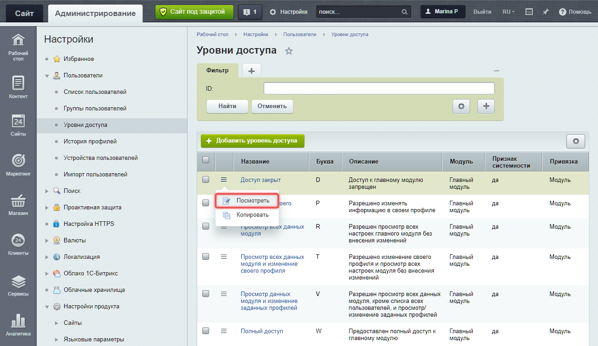

Права доступа -- правила, которые определяют, что может делать пользователь на сайте. Это важно для безопасности и разграничения работы с контентом.

## Основные принципы работы прав доступа

1. **Права на объекты**. Права можно настроить для страниц, файлов, информационных блоков и модулей.

2. **Наследование прав**. Дочерние элементы наследуют права доступа от родительского раздела. Это позволяет не задавать права для каждого подраздела вручную. При необходимости для любого подраздела или элемента можно настроить индивидуальные права.

3. **Максимальные права**. Права пользователя складываются из максимальных прав всех групп, в которых он состоит. Например, если пользователь состоит в двух группах с правами *Чтение* и *Запись*, он получит право *Запись*.



Максимальные права имеет администратор сайта с идентификатором `1`. Он назначает права другим пользователям.



## Группы пользователей

Каждый пользователь входит в одну из групп. Если посетитель не авторизован, он автоматически попадает в группу *Неавторизованные пользователи*. У этой группы минимальные права: они могут просматривать данные, разрешенные администратором.

После регистрации пользователь становится частью базовой группы, указанной в настройках Главного модуля. Например, в *1С-Битрикс: управление сайтом* по умолчанию это группа *Зарегистрированные пользователи*.

Администратор может добавлять зарегистрированных пользователей в другие группы с разными правами.

### Права по умолчанию

В Bitrix Framework есть стандартные группы пользователей с предустановленными правами.

-  Администраторы

-  Все пользователи (в том числе неавторизованные)

-  Пользователи, имеющие право голосовать за рейтинг

-  Пользователи имеющие право голосовать за авторитет

В зависимости от установленного решения,  набор стандартных групп может быть больше.



Администраторы имеют полный доступ ко всем модулям и функциям.



### Как ограничить доступ к публичной части сайта

Доступ к сайту можно временно закрыть для всех пользователей, кроме администраторов.

1. Откройте страницу *Настройки > Настройки продукта > Настройки модулей > Главный модуль.*

2. Включите опцию *Закрыть сайт для посетителей*.

3. Укажите сообщение для пользователей, которые откроют сайт.

### Настройки интерфейса для групп

В Bitrix Framework можно настроить отображение разных шаблонов для разных групп пользователей.

-  Перейдите в *Настройки > Настройки продукта > Сайты > Список сайтов.*

-  Выберите сайт и настройте шаблон для каждой группы пользователей.

## Уровни доступа

Уровень доступа определяет, какие операции доступны пользователю, например:

-  Чтение -- просмотр информации.

-  Запись -- редактирование и добавление данных.

-  Полный доступ -- полный контроль над объектом, включая управление правами.

Уровни доступа наследуются: если для текущего раздела или страницы права не заданы, используются права родительского раздела.

### Управление уровнями доступа

Управлять уровнями доступа можно в административном разделе на странице *Настройки > Пользователи > Уровни доступа*.

-  Пользовательские уровни доступа можно редактировать или создавать новые.

-  Системные уровни доступа нельзя отредактировать, только посмотреть.

{width=1304px height=755px}

### Создание нового уровня доступа

1. Нажмите *Добавить уровень доступа*.

2. Заполните параметры формы.

   -  Название -- напишите наименование уровня.

   -  Модуль -- выберите модуль, для которого создается уровень.

   -  Привязка -- выберите функционал модуля.

   -  Буква -- укажите краткое обозначение уровня доступа.

   -  Описание -- добавьте описание, если необходимо.

   {width=700px height=520px}

3. На вкладке *Включаемые операции* выберите разрешенные действия.

   {width=663px height=533px}

## Права доступа к инфоблокам

Права доступа для информационных блоков работают аналогично правам статических страниц и разделов. Они наследуются по иерархии: от инфоблока к разделу и элементу. Если пользователь имеет права Полный доступ на инфоблок, он может управлять доступом к его элементам.

Права для элементов и разделов инфоблоков настраиваются в административном разделе. Для этого должен быть включен расширенный режим управления правами.

Права доступа к инфоблокам настраиваются в форме редактирования инфоблока на вкладке *Доступ*. Есть два режима:

1. Простой режим -- права задаются для всего инфоблока.

2. Расширенный режим -- права можно задавать для отдельных разделов и элементов.



В модуле CRM действует [ролевая система прав](https://helpdesk.bitrix24.ru/open/6268091/). Настройки доступа к каталогу товаров в CRM выполняются для [ролей](https://helpdesk.bitrix24.ru/open/16556596/).



### Настроить права для инфоблока

1. Перейдите в *Контент > Инфоблоки > Типы инфоблоков > \[название\_типа\] > \[название\_инфоблока\]*.

2. На вкладке *Доступ* выберите группы и установите права.

### Настроить права для разделов и элементов

1. Включите опцию *Расширенное управление правами* в настройках инфоблока.

   {width=685px height=568px}

2. Откройте форму редактирования элемента или раздел.

3. Установите права на вкладке Доступ.

### Пример наследования прав

Допустим, нужно запретить доступ к разделу Аксессуары в каталоге Одежда. Если права для разделов каталога не изменялись, они унаследуют права инфоблока Каталоги.

Чтобы запретить доступ:

1. Перейдите в административный раздел *Контент > Каталоги > Одежда*.

2. Выберите раздел Аксессуары и нажмите Изменить.

3. Во вкладке Доступ добавьте новое правило для группы Все посетители и установите Нет доступа.

После сохранения раздел Аксессуары будет скрыт для всех посетителей.

## Права доступа к файлам и папкам

Права на файлы и папки настраиваются через *Менеджер файлов*.

1. В административном разделе откройте *Контент > Структура сайта > Файлы и папки*.

2. Выберите файл или папку и нажмите *Права на доступ*.

3. Установите права для групп пользователей.

### Файл .access.php

Система проверяет права доступа из `.access.php` в прологе, то есть перед загрузкой контента и выполнением кода модулей. Пролог работает быстрее проверки прав через интерфейс, так как не требует загрузки ядра. Обычно используется для закрытия доступа к служебным папкам.

Файл содержит PHP-массив формата:

```php
$PERM["файл_или_папка"]["ID_группы"] = "уровень_доступа";
```

-  **файл или папка** -- имя файла или папки, для которых назначаются права доступа.

-  **ID группы пользователей** -- идентификатор группы пользователей, на которую распространяется данное право. Можно использовать символ `*` , чтобы указать все группы.

-  **Уровень доступа** -- поддерживаются значения:

   -  `D` Deny -- запрет,

   -  `R` Read -- чтение,

   -  `U` Workflow -- редактирование через документооборот,

   -  `W` Write -- полное редактирование,

   -  `X` Full -- все права + управление доступом.

### Пример настройки прав через файл

```php
<?
/* Настройка прав для файла /dir/index.php */
$PERM["index.php"]["2"] = "R"; // Группа ID=2 имеет право на чтение (R)
$PERM["index.php"]["3"] = "D"; // Группа ID=3 имеет запрет доступа (D)

/* Настройка прав для папки /admin. Только администраторы должны иметь доступ */
$PERM["admin"]["*"] = "D"; // Для всех групп доступ к папке /admin запрещен (D)
$PERM["admin"]["1"] = "R"; // Администраторы ID=1 имеет право на чтение (R)

/* Настройка прав для корневой директории /. Все могут просматривать данные. Редактировать только администратор. */
$PERM["/"]["*"] = "R"; // Все пользователи имеют право на чтение корневой директории (R)
$PERM["/"]["1"] = "W"; // Администратор (ID=1) имеет право на запись (W)
?>
```

### Проблемы с правами на файлы и их решение

**Не удается сохранить изменения через FTP**

Решение: убедиться, что пользователь веб-сервера имеет права на запись в файлы. Использовать команду `chmod` для изменения прав.

```bash
chmod -R 775 /path/to/dir
```

**Файлы загружаются через FTP, но не редактируются в продукте.**

Решение: проверить права доступа для пользователя веб-сервера. Убедиться, что файлы принадлежат правильному пользователю.

### Права доступа к публичным страницам

При создании статических страницы или раздела в публичном разделе сайта можно сразу ограничить доступ с помощью опции *Ограничить доступ к странице/разделу*. Укажите группы, которым будет доступна страница.

При редактировании страницы или раздела можно настроить права более детально. Например, ограничить доступ для отдельных пользователей.

1. Откройте страницу или раздел для редактирования.

2. Задайте нужные права для групп.

3. Чтобы добавить новое правило, нажмите Добавить право доступа.

4. Выберите пользователя или группу и задайте уровень прав.

## Права доступа к модулям

Bitrix Framework поддерживает два уровня разграничения прав доступа:

1. Доступ на файлы и каталоги.

2. Права в рамках логики модуля.

Для статичных публичных страниц применяется только первый уровень доступа на файлы и каталоги. Если файл является частью модуля, система проверяет второй уровень прав из настроек модуля.

### Как настроить права

Права доступа к модулям можно настроить двумя способами.

1. **Через настройки группы пользователей**.

   -  Перейдите в *Настройки > Пользователи > Группы пользователей.*

   -  Выберите группу.

   -  Настройте права для каждого модуля на вкладке Доступ.

      {width=657px height=490px}

2. **Через настройки модуля**.

   -  Перейдите в *Настройки > Настройки продукта > Настройки модулей*.

   -  Выберите модуль.

   -  Настройте права для групп на вкладке Доступ.

      {width=702px height=361px}

### Разграничение прав в логике модулей

1. **Права.** Если пользователь обладает несколькими правами, выбираются максимальные.

2. **Роли.** Если пользователь обладает несколькими ролями, он получает максимальные возможности этих ролей.

Модули, которые поддерживают роли, можно найти в административном разделе на странице *Настройки > Пользователи > Уровни доступа* . В остальных модулях и настройках системы используются права.