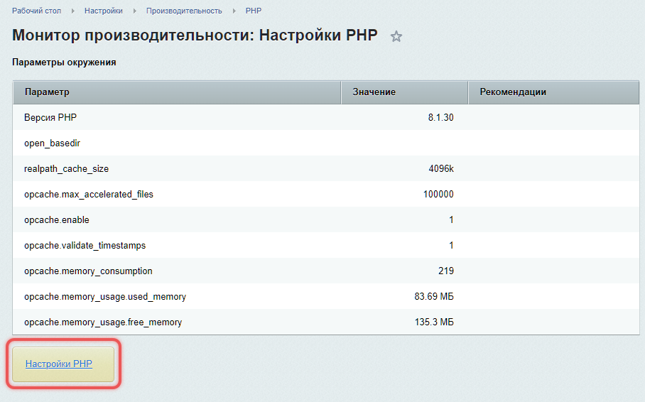

CAPTCHA (Completely Automated Public Turing test to tell Computers and Humans Apart) защищает сайт от действий роботов, например от автоматической регистрации или отправки формы.

## Требования для работы CAPTCHA

Для работы CAPTCHA на сервере должны быть установлены библиотеки FreeType и GD. Они нужны для работы с изображениями и генерации CAPTCHA.

Для создания изображений CAPTCHA используются функции библиотек:

-  `imagecreatetruecolor` -- создает изображение.

-  `imagejpeg` -- сохраняет его в формате JPEG.

Проверить наличие библиотек можно в административном разделе продукта:

1. Откройте страницу *Настройки > Производительность > PHP .*

2. Перейдите по ссылке Настройки PHP.

{width=908px height=566px}

## Настроить CAPTCHA

Настроить CAPTCHA и включить защиту от автоматических регистраций можно в разделе *Настройки > Настройки продукта > CAPTCHA*.

{width=1240px height=820px}

### Основные параметры

В поле Профиль можно выбрать шаблон настроек или указать их вручную. Рекомендации по основным параметрам:

-  Прозрачность текста -- 40–50%.

-  Угол отклонения от вертикали -- от -30 до 30 градусов.

-  Нелинейные искажения -- рекомендуем включить. Это искажение символов CAPTCHA, чтобы усложнить распознавание для роботов. Например, изгибы или волны.

-  Шрифт  -- используйте `bitrix_captcha.ttf` или другой нестандартный шрифт. Шрифт `bitrix_captcha.ttf` доступен в системе по умолчанию. Если вы хотите использовать другой шрифт, загрузите его в папку `/bitrix/modules/main/fonts/`. Поддерживаются файлы шрифтов в формате `.ttf`.

## Подключить CAPTCHA

CAPTCHA можно подключить несколькими способами. Выберите подходящий вариант в зависимости от ваших задач.

### В настройках модуля

Показ CAPTCHA можно включить в настройках модулей: Главный, Блоги и Wiki.

В Главном модуле есть две опции, которые отвечают за авторизацию пользователя:

1. Использовать CAPTCHA при восстановлении пароля

2. Использовать CAPTCHA при регистрации

### В параметрах компонента

Показ CAPTCHA можно подключить для отдельных компонентов, которые отвечают за отправку форм. Например, в параметрах компонента Форма обратной связи есть опция *Использовать защиту от автоматических сообщений (CAPTCHA) для неавторизованных пользователей*.

### В настройках групп пользователей

В настройках групп пользователей можно включить показ CAPTCHA после неудачных попыток ввода пароля.

1. Перейдите в раздел *Настройки > Пользователи > Группы пользователей*.

2. Выберите группу и откройте вкладку Безопасность.

3. Найдите опцию *Количество попыток ввода пароля до показа CAPTCHA*:

   -  Если значение равно нулю или выбрана опция Не переопределять, CAPTCHA отключена.

   -  Если значение больше нуля, CAPTCHA включается после указанного числа попыток.



Убедитесь, что шаблон компонента авторизации поддерживает отображение CAPTCHA. Иначе после указанного числа попыток система потребует ввода CAPTCHA, но шаблон ее не отобразит, и пользователь не сможет авторизоваться.



### В своих скриптах

Для создания CAPTCHA в своих скриптах используйте следующий код:

```php
<?php
// Подключаем класс CAPTCHA
include_once($_SERVER["DOCUMENT_ROOT"]."/bitrix/modules/main/classes/general/captcha.php");

// Создаем объект CAPTCHA
$cpt = new CCaptcha();

// Получаем или генерируем пароль для CAPTCHA
$captchaPass = COption::GetOptionString("main", "captcha_password", "");
if (strlen($captchaPass) <= 0) {
    $captchaPass = randString(10); // Генерируем случайный пароль с помощью функции randString
    COption::SetOptionString("main", "captcha_password", $captchaPass); // Сохраняем пароль
}

// Устанавливаем пароль для шифрования CAPTCHA
$cpt->SetCodeCrypt($captchaPass);
?>
```

Добавьте код в PHP-скрипт, который отвечает за отображение формы. Он создаст CAPTCHA и сгенерирует скрытое поле с кодом.

Добавьте в форму три элемента:

```html
<!-- Скрытое поле с кодом CAPTCHA -->
<input name="captcha_code" value="<?=htmlspecialchars($cpt->GetCodeCrypt());?>" type="hidden">

<!-- Поле для ввода CAPTCHA -->
<input id="captcha_word" name="captcha_word" type="text">

<!-- Изображение CAPTCHA -->
GetCodeCrypt());?>">
```

Чтобы проверить, правильно ли пользователь ввел CAPTCHA, добавьте в обработчик формы код:

```php
<?php
// Проверяем, правильно ли введена CAPTCHA
if (!$APPLICATION->CaptchaCheckCode($_POST["captcha_word"], $_POST["captcha_code"])) {
    // Неправильное значение
    echo "CAPTCHA введена неверно. Попробуйте еще раз.";
} else {
    // Правильное значение
    echo "CAPTCHA введена верно.";
}
?>
```

## Методы работы с CAPTCHA

-  `CaptchaGetCode` -- создает объект класса `CCaptcha` и возвращает сгенерированный код. Это нестатический метод.

-  `CaptchaCheckCode` -- проверяет код CAPTCHA.

### Пример использования методов

```php
// Получаем код CAPTCHA
$code = $APPLICATION->CaptchaGetCode();
```

Код передается в HTML для отображения картинки. Картинка генерируется скриптом `/bitrix/tools/captcha.php`.

```html
<!-- Скрытое поле для хранения идентификатора CAPTCHA -->
<input type="hidden" name="captcha_sid" value="<?=$code;?>" />

<!-- Отображение картинки CAPTCHA -->
" alt="CAPTCHA" />
```

При обращении к скрипту:

1. Генерируется картинка.

2. Добавляется запись в базу данных.

Для проверки кода CAPTCHA при обработке формы используйте метод `CaptchaCheckCode`.

```php
// Проверяем введенный пользователем код CAPTCHA
if (!$APPLICATION->CaptchaCheckCode($_POST["captcha_word"], $_POST["captcha_sid"])) {
    echo 'Неверный код CAPTCHA';
}
```

### Как изменить настройки CAPTCHA

Чтобы настроить CAPTCHA для вашего сайта используйте класс `CCaptcha`.

```php
// Подключаем класс CAPTCHA
include_once($_SERVER["DOCUMENT_ROOT"]."/bitrix/modules/main/classes/general/captcha.php");

// Создаем объект CAPTCHA
$cpt = new CCaptcha();

// Устанавливаем длину кода (по умолчанию 5 символов)
$cpt->SetCodeLength(6);

// Генерируем новый код
$cpt->SetCode();

// Получаем идентификатор CAPTCHA
$code = $cpt->GetSID();
```

#### Настройки в отдельном файле

Если вы хотите изменить логику или внешний вид CAPTCHA, но при этом оставить оригинальный файл `captcha.php` без изменений:

1. Создайте файл `captcha2.php` и скопируйте в него содержимое `captcha.php`.

2. Настройте отображение CAPTCHA в `captcha2.php`.

3. Обновите путь к файлу в HTML-коде.

```html
<!-- Скрытое поле для хранения идентификатора CAPTCHA -->
<input type="hidden" name="captcha_sid" value="<?=$code;?>" />

<!-- Отображение картинки CAPTCHA через кастомный скрипт captcha2.php  -->
"alt="CAPTCHA" />
```